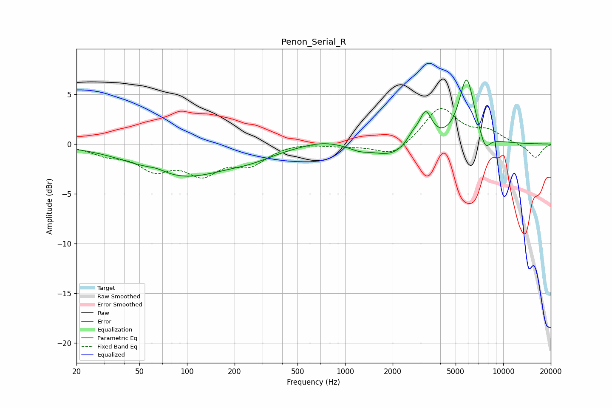

# Penon_Serial_R
See [usage instructions](https://github.com/jaakkopasanen/AutoEq#usage) for more options and info.

### Parametric EQs
Apply preamp of -6.5 dB when using parametric equalizer.

|   # | Type    |   Fc (Hz) |    Q |   Gain (dB) |
|-----|---------|-----------|------|-------------|
|   1 | Peaking |        64 | 2.28 |         0.4 |
|   2 | Peaking |        93 | 0.49 |        -3.2 |
|   3 | Peaking |       257 | 0.98 |        -0.7 |
|   4 | Peaking |       721 | 1.1  |         0.5 |
|   5 | Peaking |      1229 | 2.2  |        -0.4 |
|   6 | Peaking |      1961 | 1.24 |        -1.2 |
|   7 | Peaking |      2677 | 3.58 |         0.9 |
|   8 | Peaking |      3231 | 3.55 |         3   |
|   9 | Peaking |      5871 | 2.84 |         6.6 |
|  10 | Peaking |      7678 | 4.09 |        -1.6 |

### Fixed Band EQs
When using fixed band (also called graphic) equalizer, apply preamp of **-3.7 dB** (if available) and set gains manually with these parameters.

|   # | Type    |   Fc (Hz) |    Q |   Gain (dB) |
|-----|---------|-----------|------|-------------|
|   1 | Peaking |        31 | 1.41 |        -0.9 |
|   2 | Peaking |        62 | 1.41 |        -2.3 |
|   3 | Peaking |       125 | 1.41 |        -2.7 |
|   4 | Peaking |       250 | 1.41 |        -1.8 |
|   5 | Peaking |       500 | 1.41 |         0.2 |
|   6 | Peaking |      1000 | 1.41 |        -0.2 |
|   7 | Peaking |      2000 | 1.41 |        -1.3 |
|   8 | Peaking |      4000 | 1.41 |         3.7 |
|   9 | Peaking |      8000 | 1.41 |         1.1 |
|  10 | Peaking |     16000 | 1.41 |        -1.4 |

### Graphs

