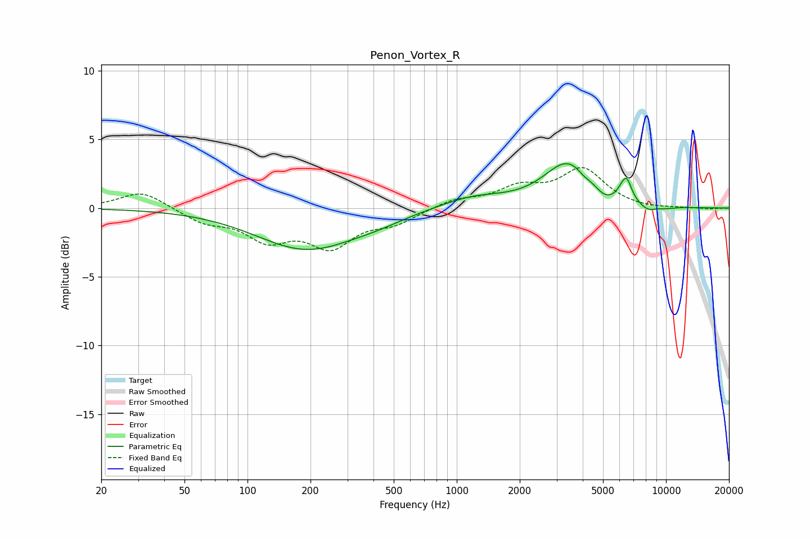

# Penon_Vortex_R
See [usage instructions](https://github.com/jaakkopasanen/AutoEq#usage) for more options and info.

### Parametric EQs
Apply preamp of -3.3 dB when using parametric equalizer.

|   # | Type    |   Fc (Hz) |    Q |   Gain (dB) |
|-----|---------|-----------|------|-------------|
|   1 | Peaking |       192 | 0.59 |        -3   |
|   2 | Peaking |       421 | 1.1  |        -0.3 |
|   3 | Peaking |      1197 | 0.87 |         0.8 |
|   4 | Peaking |      3401 | 1.23 |         3.2 |
|   5 | Peaking |      4033 | 5.59 |        -0.2 |
|   6 | Peaking |      5098 | 2.79 |        -0.6 |
|   7 | Peaking |      6125 | 6    |         0.4 |
|   8 | Peaking |      6493 | 5.66 |         1.5 |
|   9 | Peaking |      8162 | 3.26 |        -0.5 |
|  10 | Peaking |     10000 | 2.41 |        -0.2 |

### Fixed Band EQs
When using fixed band (also called graphic) equalizer, apply preamp of **-3.0 dB** (if available) and set gains manually with these parameters.

|   # | Type    |   Fc (Hz) |    Q |   Gain (dB) |
|-----|---------|-----------|------|-------------|
|   1 | Peaking |        31 | 1.41 |         1.3 |
|   2 | Peaking |        62 | 1.41 |        -0.9 |
|   3 | Peaking |       125 | 1.41 |        -2.1 |
|   4 | Peaking |       250 | 1.41 |        -2.6 |
|   5 | Peaking |       500 | 1.41 |        -1   |
|   6 | Peaking |      1000 | 1.41 |         0.6 |
|   7 | Peaking |      2000 | 1.41 |         1.3 |
|   8 | Peaking |      4000 | 1.41 |         2.7 |
|   9 | Peaking |      8000 | 1.41 |        -0.1 |
|  10 | Peaking |     16000 | 1.41 |        -0.1 |

### Graphs

