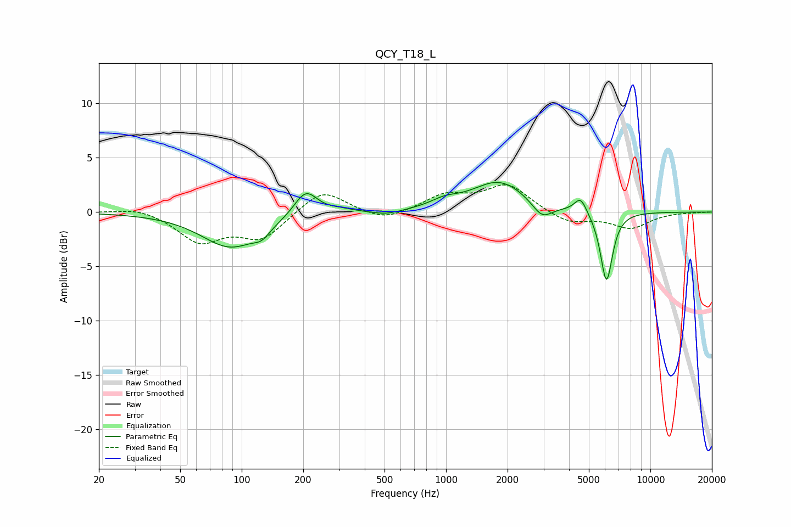

# QCY_T18_L
See [usage instructions](https://github.com/jaakkopasanen/AutoEq#usage) for more options and info.

### Parametric EQs
Apply preamp of -2.8 dB when using parametric equalizer.

|   # | Type    |   Fc (Hz) |    Q |   Gain (dB) |
|-----|---------|-----------|------|-------------|
|   1 | Peaking |        88 | 0.99 |        -3.2 |
|   2 | Peaking |       125 | 3.56 |        -0.8 |
|   3 | Peaking |       206 | 2.5  |         2.4 |
|   4 | Peaking |       303 | 2.17 |         0.3 |
|   5 | Peaking |       513 | 1.97 |        -0.4 |
|   6 | Peaking |       984 | 2.07 |         0.6 |
|   7 | Peaking |      1823 | 1.06 |         2.8 |
|   8 | Peaking |      2952 | 2.83 |        -1.5 |
|   9 | Peaking |      4557 | 4.65 |         1.5 |
|  10 | Peaking |      6098 | 4.62 |        -6.5 |

### Fixed Band EQs
When using fixed band (also called graphic) equalizer, apply preamp of **-2.6 dB** (if available) and set gains manually with these parameters.

|   # | Type    |   Fc (Hz) |    Q |   Gain (dB) |
|-----|---------|-----------|------|-------------|
|   1 | Peaking |        31 | 1.41 |         0.5 |
|   2 | Peaking |        62 | 1.41 |        -2.6 |
|   3 | Peaking |       125 | 1.41 |        -2.4 |
|   4 | Peaking |       250 | 1.41 |         2.2 |
|   5 | Peaking |       500 | 1.41 |        -0.9 |
|   6 | Peaking |      1000 | 1.41 |         1.5 |
|   7 | Peaking |      2000 | 1.41 |         2.5 |
|   8 | Peaking |      4000 | 1.41 |        -1.1 |
|   9 | Peaking |      8000 | 1.41 |        -1.4 |
|  10 | Peaking |     16000 | 1.41 |        -0   |

### Graphs

