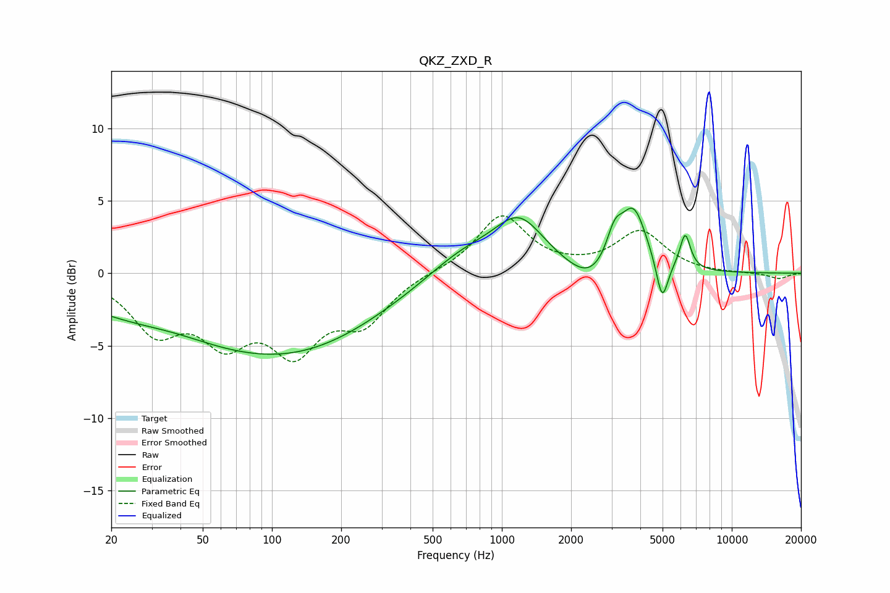

# QKZ_ZXD_R
See [usage instructions](https://github.com/jaakkopasanen/AutoEq#usage) for more options and info.

### Parametric EQs
Apply preamp of -4.6 dB when using parametric equalizer.

|   # | Type    |   Fc (Hz) |    Q |   Gain (dB) |
|-----|---------|-----------|------|-------------|
|   1 | Peaking |        37 | 0.78 |         0.7 |
|   2 | Peaking |        67 | 0.23 |        -4.8 |
|   3 | Peaking |       143 | 0.43 |        -1.4 |
|   4 | Peaking |       677 | 0.88 |         1.7 |
|   5 | Peaking |      1189 | 1.28 |         3.5 |
|   6 | Peaking |      2412 | 1.55 |        -1.4 |
|   7 | Peaking |      3091 | 4    |         2   |
|   8 | Peaking |      3742 | 2.45 |         4.2 |
|   9 | Peaking |      4980 | 5.5  |        -2.9 |
|  10 | Peaking |      6269 | 6    |         2.4 |

### Fixed Band EQs
When using fixed band (also called graphic) equalizer, apply preamp of **-4.1 dB** (if available) and set gains manually with these parameters.

|   # | Type    |   Fc (Hz) |    Q |   Gain (dB) |
|-----|---------|-----------|------|-------------|
|   1 | Peaking |        31 | 1.41 |        -3.7 |
|   2 | Peaking |        62 | 1.41 |        -3.9 |
|   3 | Peaking |       125 | 1.41 |        -4.7 |
|   4 | Peaking |       250 | 1.41 |        -3   |
|   5 | Peaking |       500 | 1.41 |         0.1 |
|   6 | Peaking |      1000 | 1.41 |         4   |
|   7 | Peaking |      2000 | 1.41 |         0.1 |
|   8 | Peaking |      4000 | 1.41 |         2.8 |
|   9 | Peaking |      8000 | 1.41 |        -0   |
|  10 | Peaking |     16000 | 1.41 |        -0.4 |

### Graphs

