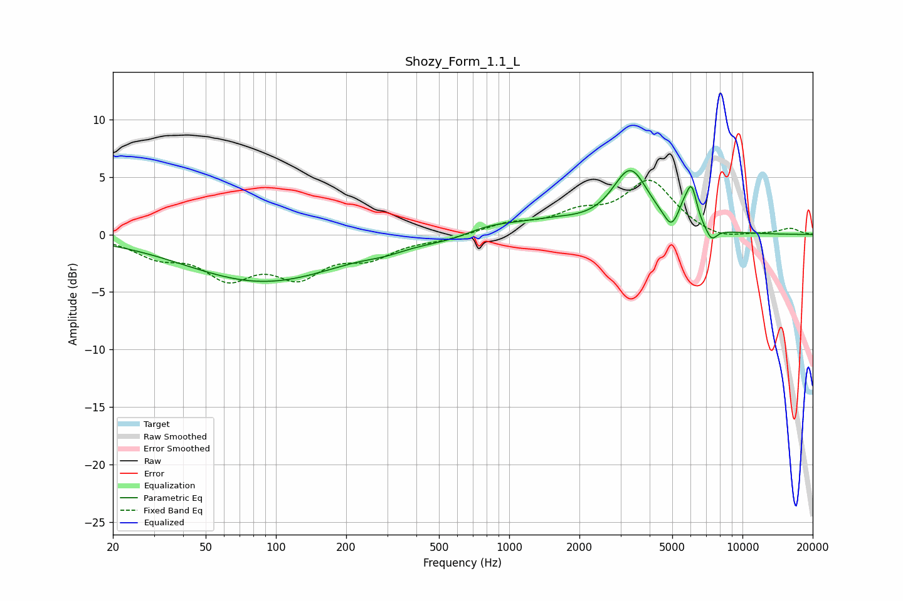

# Shozy_Form_1.1_L
See [usage instructions](https://github.com/jaakkopasanen/AutoEq#usage) for more options and info.

### Parametric EQs
Apply preamp of -5.7 dB when using parametric equalizer.

|   # | Type    |   Fc (Hz) |    Q |   Gain (dB) |
|-----|---------|-----------|------|-------------|
|   1 | Peaking |        88 | 0.42 |        -4.1 |
|   2 | Peaking |       296 | 1.69 |        -0.4 |
|   3 | Peaking |       590 | 1.04 |        -0.8 |
|   4 | Peaking |       784 | 0.93 |         1.2 |
|   5 | Peaking |      1559 | 1.02 |         0.8 |
|   6 | Peaking |      3308 | 1.8  |         5.3 |
|   7 | Peaking |      4938 | 4.97 |        -1.2 |
|   8 | Peaking |      5586 | 6    |         1   |
|   9 | Peaking |      6052 | 5.93 |         3.2 |
|  10 | Peaking |      7361 | 5.52 |        -1.1 |

### Fixed Band EQs
When using fixed band (also called graphic) equalizer, apply preamp of **-4.8 dB** (if available) and set gains manually with these parameters.

|   # | Type    |   Fc (Hz) |    Q |   Gain (dB) |
|-----|---------|-----------|------|-------------|
|   1 | Peaking |        31 | 1.41 |        -1.6 |
|   2 | Peaking |        62 | 1.41 |        -3.3 |
|   3 | Peaking |       125 | 1.41 |        -3.1 |
|   4 | Peaking |       250 | 1.41 |        -1.7 |
|   5 | Peaking |       500 | 1.41 |        -0.4 |
|   6 | Peaking |      1000 | 1.41 |         0.8 |
|   7 | Peaking |      2000 | 1.41 |         1.5 |
|   8 | Peaking |      4000 | 1.41 |         4.5 |
|   9 | Peaking |      8000 | 1.41 |        -0.6 |
|  10 | Peaking |     16000 | 1.41 |         0.5 |

### Graphs

