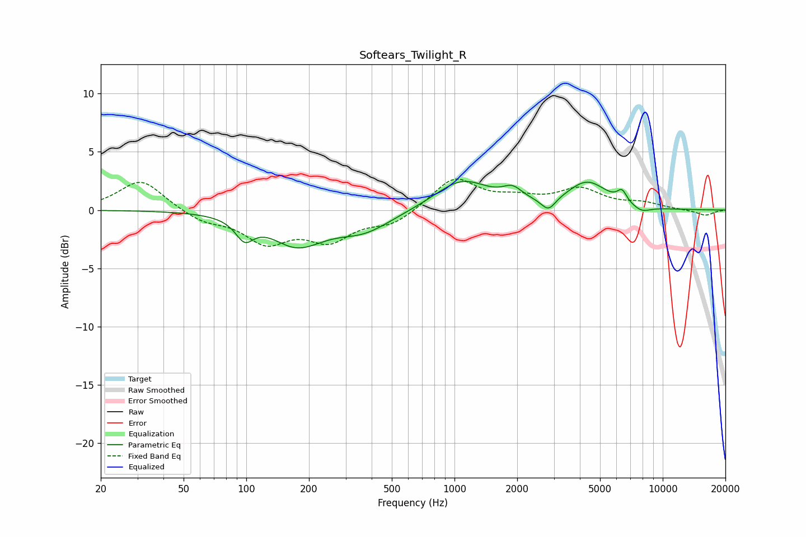

# Softears_Twilight_R
See [usage instructions](https://github.com/jaakkopasanen/AutoEq#usage) for more options and info.

### Parametric EQs
Apply preamp of -2.6 dB when using parametric equalizer.

|   # | Type    |   Fc (Hz) |    Q |   Gain (dB) |
|-----|---------|-----------|------|-------------|
|   1 | Peaking |        98 | 3.28 |        -1.7 |
|   2 | Peaking |       178 | 1.17 |        -3.2 |
|   3 | Peaking |       186 | 1.68 |         0.4 |
|   4 | Peaking |       367 | 1.04 |        -1.6 |
|   5 | Peaking |      1087 | 1.09 |         2.6 |
|   6 | Peaking |      1901 | 2.98 |         1   |
|   7 | Peaking |      2826 | 4.18 |        -1.1 |
|   8 | Peaking |      4341 | 1.47 |         2.3 |
|   9 | Peaking |      6376 | 5.99 |         1   |
|  10 | Peaking |      7923 | 3.04 |        -0.5 |

### Fixed Band EQs
When using fixed band (also called graphic) equalizer, apply preamp of **-2.8 dB** (if available) and set gains manually with these parameters.

|   # | Type    |   Fc (Hz) |    Q |   Gain (dB) |
|-----|---------|-----------|------|-------------|
|   1 | Peaking |        31 | 1.41 |         2.6 |
|   2 | Peaking |        62 | 1.41 |        -0.9 |
|   3 | Peaking |       125 | 1.41 |        -2.6 |
|   4 | Peaking |       250 | 1.41 |        -2.4 |
|   5 | Peaking |       500 | 1.41 |        -1.2 |
|   6 | Peaking |      1000 | 1.41 |         2.7 |
|   7 | Peaking |      2000 | 1.41 |         0.8 |
|   8 | Peaking |      4000 | 1.41 |         1.7 |
|   9 | Peaking |      8000 | 1.41 |         0.5 |
|  10 | Peaking |     16000 | 1.41 |        -0.5 |

### Graphs

