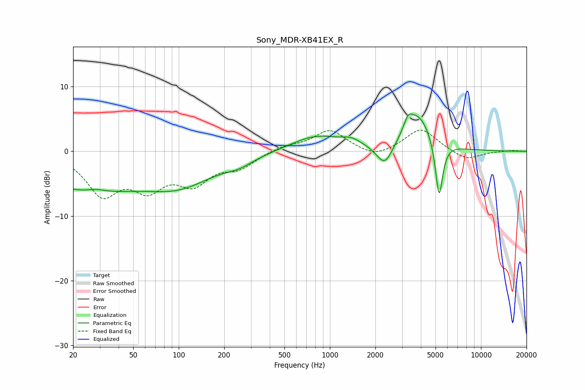

# Sony_MDR-XB41EX_R
See [usage instructions](https://github.com/jaakkopasanen/AutoEq#usage) for more options and info.

### Parametric EQs
Apply preamp of -5.9 dB when using parametric equalizer.

|   # | Type    |   Fc (Hz) |    Q |   Gain (dB) |
|-----|---------|-----------|------|-------------|
|   1 | Peaking |        24 | 0.44 |        -5.7 |
|   2 | Peaking |        28 | 2.06 |         0.7 |
|   3 | Peaking |       101 | 0.59 |        -4.5 |
|   4 | Peaking |       253 | 1.51 |        -1   |
|   5 | Peaking |       816 | 0.83 |         2.4 |
|   6 | Peaking |      1392 | 2.21 |         0.9 |
|   7 | Peaking |      2308 | 2.61 |        -3.5 |
|   8 | Peaking |      3293 | 4.96 |         1.8 |
|   9 | Peaking |      3835 | 1.53 |         5.7 |
|  10 | Peaking |      5280 | 5.69 |        -9.2 |

### Fixed Band EQs
When using fixed band (also called graphic) equalizer, apply preamp of **-3.4 dB** (if available) and set gains manually with these parameters.

|   # | Type    |   Fc (Hz) |    Q |   Gain (dB) |
|-----|---------|-----------|------|-------------|
|   1 | Peaking |        31 | 1.41 |        -6.2 |
|   2 | Peaking |        62 | 1.41 |        -4.8 |
|   3 | Peaking |       125 | 1.41 |        -4.3 |
|   4 | Peaking |       250 | 1.41 |        -2.2 |
|   5 | Peaking |       500 | 1.41 |         0.8 |
|   6 | Peaking |      1000 | 1.41 |         3.3 |
|   7 | Peaking |      2000 | 1.41 |        -1.2 |
|   8 | Peaking |      4000 | 1.41 |         3.6 |
|   9 | Peaking |      8000 | 1.41 |        -1.5 |
|  10 | Peaking |     16000 | 1.41 |         0.2 |

### Graphs

