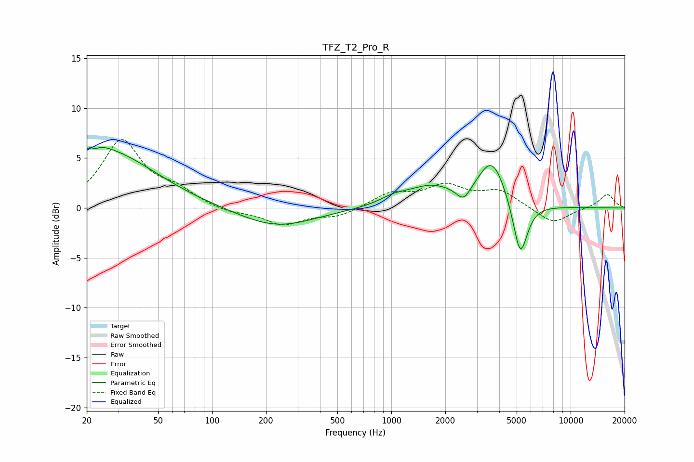

# TFZ_T2_Pro_R
See [usage instructions](https://github.com/jaakkopasanen/AutoEq#usage) for more options and info.

### Parametric EQs
Apply preamp of -6.2 dB when using parametric equalizer.

|   # | Type    |   Fc (Hz) |    Q |   Gain (dB) |
|-----|---------|-----------|------|-------------|
|   1 | Peaking |        22 | 1.49 |         1.4 |
|   2 | Peaking |        22 | 5.64 |         3.2 |
|   3 | Peaking |        22 | 5.88 |        -3.2 |
|   4 | Peaking |        28 | 0.54 |         5   |
|   5 | Peaking |       229 | 0.67 |        -1.9 |
|   6 | Peaking |      1024 | 1.96 |         0.6 |
|   7 | Peaking |      1659 | 0.99 |         2   |
|   8 | Peaking |      2528 | 3.58 |        -1.4 |
|   9 | Peaking |      3647 | 1.8  |         4.6 |
|  10 | Peaking |      5235 | 3.41 |        -5.8 |

### Fixed Band EQs
When using fixed band (also called graphic) equalizer, apply preamp of **-7.0 dB** (if available) and set gains manually with these parameters.

|   # | Type    |   Fc (Hz) |    Q |   Gain (dB) |
|-----|---------|-----------|------|-------------|
|   1 | Peaking |        31 | 1.41 |         6.6 |
|   2 | Peaking |        62 | 1.41 |         1.4 |
|   3 | Peaking |       125 | 1.41 |        -0.5 |
|   4 | Peaking |       250 | 1.41 |        -1.6 |
|   5 | Peaking |       500 | 1.41 |        -0.8 |
|   6 | Peaking |      1000 | 1.41 |         1.4 |
|   7 | Peaking |      2000 | 1.41 |         2   |
|   8 | Peaking |      4000 | 1.41 |         1.6 |
|   9 | Peaking |      8000 | 1.41 |        -1.6 |
|  10 | Peaking |     16000 | 1.41 |         1.4 |

### Graphs

