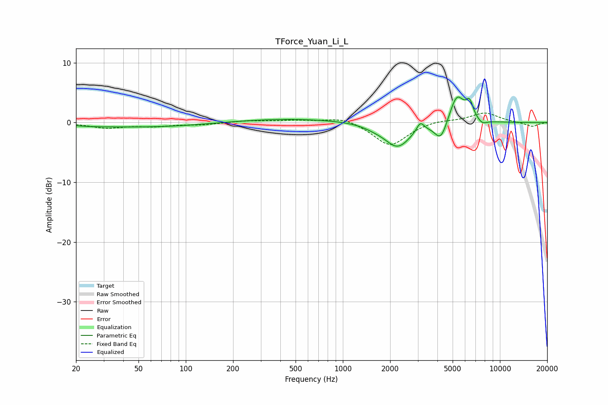

# TForce_Yuan_Li_L
See [usage instructions](https://github.com/jaakkopasanen/AutoEq#usage) for more options and info.

### Parametric EQs
Apply preamp of -4.4 dB when using parametric equalizer.

|   # | Type    |   Fc (Hz) |    Q |   Gain (dB) |
|-----|---------|-----------|------|-------------|
|   1 | Peaking |        24 | 1.21 |        -0.2 |
|   2 | Peaking |        61 | 0.37 |        -0.8 |
|   3 | Peaking |       432 | 0.35 |         0.7 |
|   4 | Peaking |      1578 | 2.1  |        -0.4 |
|   5 | Peaking |      2231 | 1.7  |        -4.1 |
|   6 | Peaking |      3113 | 5.99 |         1.6 |
|   7 | Peaking |      4209 | 3.53 |        -3.2 |
|   8 | Peaking |      5321 | 2.9  |         4.9 |
|   9 | Peaking |      6415 | 5.88 |         2.6 |
|  10 | Peaking |      7702 | 4.48 |        -0.7 |

### Fixed Band EQs
When using fixed band (also called graphic) equalizer, apply preamp of **-1.7 dB** (if available) and set gains manually with these parameters.

|   # | Type    |   Fc (Hz) |    Q |   Gain (dB) |
|-----|---------|-----------|------|-------------|
|   1 | Peaking |        31 | 1.41 |        -0.9 |
|   2 | Peaking |        62 | 1.41 |        -0.5 |
|   3 | Peaking |       125 | 1.41 |        -0.3 |
|   4 | Peaking |       250 | 1.41 |         0.3 |
|   5 | Peaking |       500 | 1.41 |         0.3 |
|   6 | Peaking |      1000 | 1.41 |         0.9 |
|   7 | Peaking |      2000 | 1.41 |        -4   |
|   8 | Peaking |      4000 | 1.41 |         0.5 |
|   9 | Peaking |      8000 | 1.41 |         1.7 |
|  10 | Peaking |     16000 | 1.41 |        -0.7 |

### Graphs

