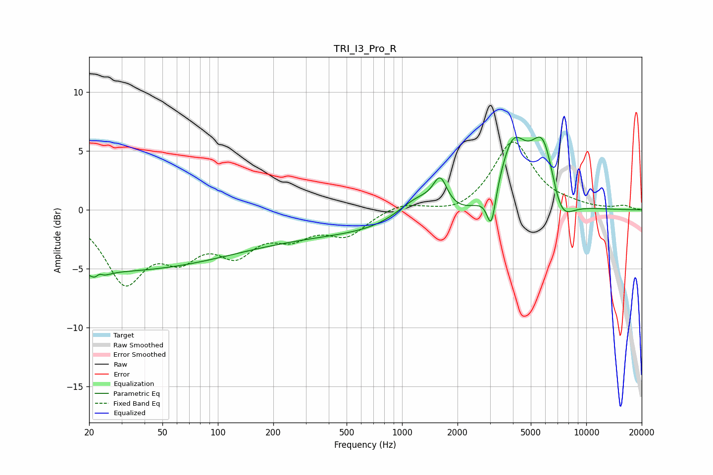

# TRI_I3_Pro_R
See [usage instructions](https://github.com/jaakkopasanen/AutoEq#usage) for more options and info.

### Parametric EQs
Apply preamp of -6.3 dB when using parametric equalizer.

|   # | Type    |   Fc (Hz) |    Q |   Gain (dB) |
|-----|---------|-----------|------|-------------|
|   1 | Peaking |        23 | 4.98 |        -3.6 |
|   2 | Peaking |        23 | 5.81 |         3.2 |
|   3 | Peaking |        23 | 0.18 |        -5.1 |
|   4 | Peaking |       644 | 0.18 |        -2   |
|   5 | Peaking |      1220 | 1.2  |         2.4 |
|   6 | Peaking |      1611 | 3.69 |         2.5 |
|   7 | Peaking |      3052 | 5.9  |        -3.2 |
|   8 | Peaking |      3995 | 1.88 |         5.5 |
|   9 | Peaking |      5873 | 1.92 |         6.5 |
|  10 | Peaking |      7183 | 2.02 |        -3.3 |

### Fixed Band EQs
When using fixed band (also called graphic) equalizer, apply preamp of **-5.9 dB** (if available) and set gains manually with these parameters.

|   # | Type    |   Fc (Hz) |    Q |   Gain (dB) |
|-----|---------|-----------|------|-------------|
|   1 | Peaking |        31 | 1.41 |        -5.8 |
|   2 | Peaking |        62 | 1.41 |        -3.1 |
|   3 | Peaking |       125 | 1.41 |        -3.1 |
|   4 | Peaking |       250 | 1.41 |        -1.8 |
|   5 | Peaking |       500 | 1.41 |        -2   |
|   6 | Peaking |      1000 | 1.41 |         0.7 |
|   7 | Peaking |      2000 | 1.41 |        -0.5 |
|   8 | Peaking |      4000 | 1.41 |         5.8 |
|   9 | Peaking |      8000 | 1.41 |         0.3 |
|  10 | Peaking |     16000 | 1.41 |         0.3 |

### Graphs

