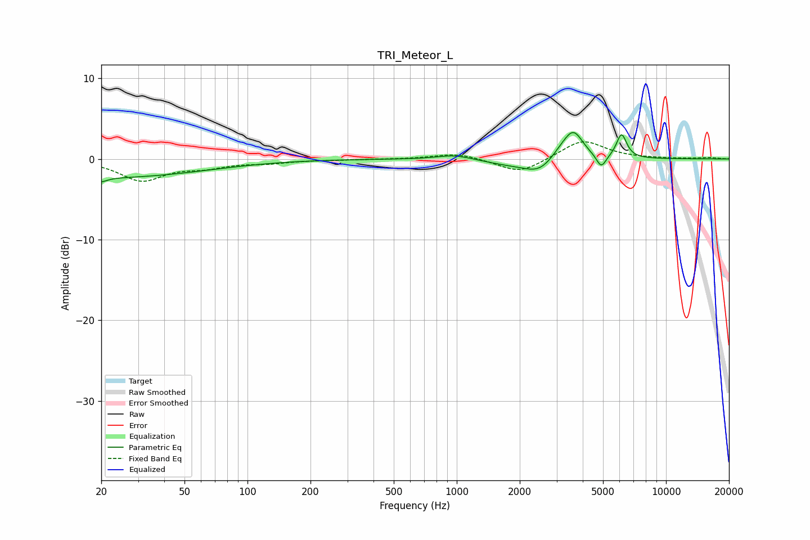

# TRI_Meteor_L
See [usage instructions](https://github.com/jaakkopasanen/AutoEq#usage) for more options and info.

### Parametric EQs
Apply preamp of -3.4 dB when using parametric equalizer.

|   # | Type    |   Fc (Hz) |    Q |   Gain (dB) |
|-----|---------|-----------|------|-------------|
|   1 | Peaking |        20 | 5.66 |        -2.3 |
|   2 | Peaking |        20 | 6    |         1.7 |
|   3 | Peaking |        21 | 0.3  |        -2.3 |
|   4 | Peaking |       973 | 1.73 |         0.6 |
|   5 | Peaking |      1754 | 1.24 |        -0.6 |
|   6 | Peaking |      2485 | 1.87 |        -1.7 |
|   7 | Peaking |      3149 | 2.59 |         1   |
|   8 | Peaking |      3617 | 3.03 |         3.3 |
|   9 | Peaking |      4906 | 6    |        -1.7 |
|  10 | Peaking |      6130 | 5.66 |         3   |

### Fixed Band EQs
When using fixed band (also called graphic) equalizer, apply preamp of **-2.2 dB** (if available) and set gains manually with these parameters.

|   # | Type    |   Fc (Hz) |    Q |   Gain (dB) |
|-----|---------|-----------|------|-------------|
|   1 | Peaking |        31 | 1.41 |        -2.6 |
|   2 | Peaking |        62 | 1.41 |        -0.8 |
|   3 | Peaking |       125 | 1.41 |        -0.4 |
|   4 | Peaking |       250 | 1.41 |        -0.1 |
|   5 | Peaking |       500 | 1.41 |        -0   |
|   6 | Peaking |      1000 | 1.41 |         0.7 |
|   7 | Peaking |      2000 | 1.41 |        -1.8 |
|   8 | Peaking |      4000 | 1.41 |         2.4 |
|   9 | Peaking |      8000 | 1.41 |         0   |
|  10 | Peaking |     16000 | 1.41 |         0.2 |

### Graphs

