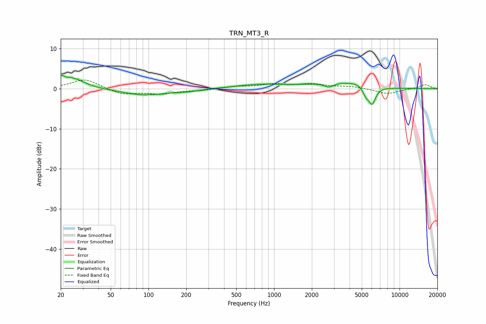

# TRN_MT3_R
See [usage instructions](https://github.com/jaakkopasanen/AutoEq#usage) for more options and info.

### Parametric EQs
Apply preamp of -3.5 dB when using parametric equalizer.

|   # | Type    |   Fc (Hz) |    Q |   Gain (dB) |
|-----|---------|-----------|------|-------------|
|   1 | Peaking |        20 | 5.98 |         1.5 |
|   2 | Peaking |        25 | 1.51 |         2.7 |
|   3 | Peaking |        92 | 0.8  |        -1.6 |
|   4 | Peaking |       204 | 1.47 |        -0.5 |
|   5 | Peaking |       791 | 0.69 |         1   |
|   6 | Peaking |      2735 | 3.47 |        -1.2 |
|   7 | Peaking |      3117 | 0.73 |         1.5 |
|   8 | Peaking |      4551 | 2.14 |         0.5 |
|   9 | Peaking |      5380 | 5.98 |        -1.7 |
|  10 | Peaking |      6027 | 4.75 |        -4.2 |

### Fixed Band EQs
When using fixed band (also called graphic) equalizer, apply preamp of **-2.2 dB** (if available) and set gains manually with these parameters.

|   # | Type    |   Fc (Hz) |    Q |   Gain (dB) |
|-----|---------|-----------|------|-------------|
|   1 | Peaking |        31 | 1.41 |         2.4 |
|   2 | Peaking |        62 | 1.41 |        -1.5 |
|   3 | Peaking |       125 | 1.41 |        -1.2 |
|   4 | Peaking |       250 | 1.41 |        -0.4 |
|   5 | Peaking |       500 | 1.41 |         0.5 |
|   6 | Peaking |      1000 | 1.41 |         1   |
|   7 | Peaking |      2000 | 1.41 |         1   |
|   8 | Peaking |      4000 | 1.41 |         0.5 |
|   9 | Peaking |      8000 | 1.41 |        -1.3 |
|  10 | Peaking |     16000 | 1.41 |         1   |

### Graphs

