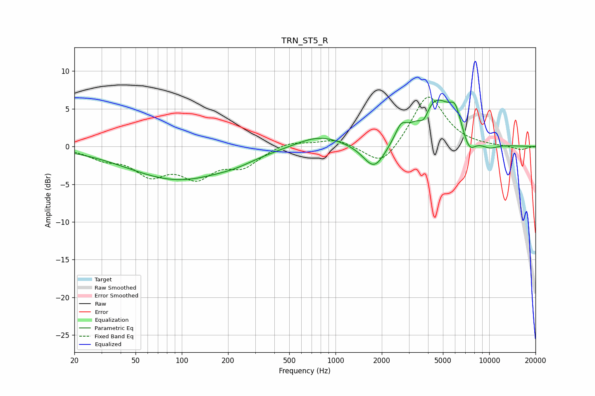

# TRN_ST5_R
See [usage instructions](https://github.com/jaakkopasanen/AutoEq#usage) for more options and info.

### Parametric EQs
Apply preamp of -6.3 dB when using parametric equalizer.

|   # | Type    |   Fc (Hz) |    Q |   Gain (dB) |
|-----|---------|-----------|------|-------------|
|   1 | Peaking |        95 | 0.43 |        -4.3 |
|   2 | Peaking |       225 | 1.26 |        -0.5 |
|   3 | Peaking |       781 | 0.94 |         1.6 |
|   4 | Peaking |      1791 | 1.92 |        -3.7 |
|   5 | Peaking |      2666 | 3.94 |         1.7 |
|   6 | Peaking |      3755 | 4.55 |        -1.6 |
|   7 | Peaking |      4470 | 1.19 |         6.4 |
|   8 | Peaking |      6010 | 3.81 |         2.6 |
|   9 | Peaking |      7400 | 3.14 |        -2.3 |
|  10 | Peaking |     10000 | 2.09 |        -0.8 |

### Fixed Band EQs
When using fixed band (also called graphic) equalizer, apply preamp of **-6.6 dB** (if available) and set gains manually with these parameters.

|   # | Type    |   Fc (Hz) |    Q |   Gain (dB) |
|-----|---------|-----------|------|-------------|
|   1 | Peaking |        31 | 1.41 |        -1.3 |
|   2 | Peaking |        62 | 1.41 |        -3.3 |
|   3 | Peaking |       125 | 1.41 |        -3.6 |
|   4 | Peaking |       250 | 1.41 |        -2.4 |
|   5 | Peaking |       500 | 1.41 |         0.8 |
|   6 | Peaking |      1000 | 1.41 |         1   |
|   7 | Peaking |      2000 | 1.41 |        -2.9 |
|   8 | Peaking |      4000 | 1.41 |         7   |
|   9 | Peaking |      8000 | 1.41 |         0   |
|  10 | Peaking |     16000 | 1.41 |        -0.5 |

### Graphs

