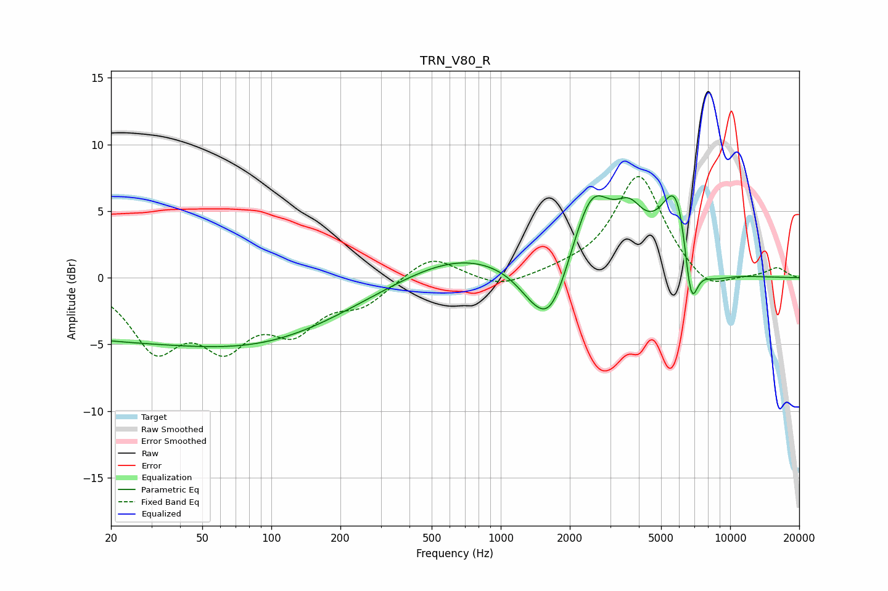

# TRN_V80_R
See [usage instructions](https://github.com/jaakkopasanen/AutoEq#usage) for more options and info.

### Parametric EQs
Apply preamp of -6.2 dB when using parametric equalizer.

|   # | Type    |   Fc (Hz) |    Q |   Gain (dB) |
|-----|---------|-----------|------|-------------|
|   1 | Peaking |        23 | 0.19 |        -4.5 |
|   2 | Peaking |       132 | 0.42 |        -2.1 |
|   3 | Peaking |       665 | 0.56 |         1.9 |
|   4 | Peaking |      1366 | 1.75 |        -1.1 |
|   5 | Peaking |      1647 | 1.76 |        -4.3 |
|   6 | Peaking |      2493 | 1.63 |         5.9 |
|   7 | Peaking |      3638 | 2.18 |         2.9 |
|   8 | Peaking |      5919 | 1.92 |         7.6 |
|   9 | Peaking |      6738 | 4.23 |        -5.9 |
|  10 | Peaking |      7910 | 1.52 |        -1.6 |

### Fixed Band EQs
When using fixed band (also called graphic) equalizer, apply preamp of **-7.7 dB** (if available) and set gains manually with these parameters.

|   # | Type    |   Fc (Hz) |    Q |   Gain (dB) |
|-----|---------|-----------|------|-------------|
|   1 | Peaking |        31 | 1.41 |        -4.9 |
|   2 | Peaking |        62 | 1.41 |        -4.3 |
|   3 | Peaking |       125 | 1.41 |        -3.4 |
|   4 | Peaking |       250 | 1.41 |        -1.7 |
|   5 | Peaking |       500 | 1.41 |         1.8 |
|   6 | Peaking |      1000 | 1.41 |        -0.8 |
|   7 | Peaking |      2000 | 1.41 |         0.3 |
|   8 | Peaking |      4000 | 1.41 |         7.7 |
|   9 | Peaking |      8000 | 1.41 |        -1.4 |
|  10 | Peaking |     16000 | 1.41 |         0.7 |

### Graphs

