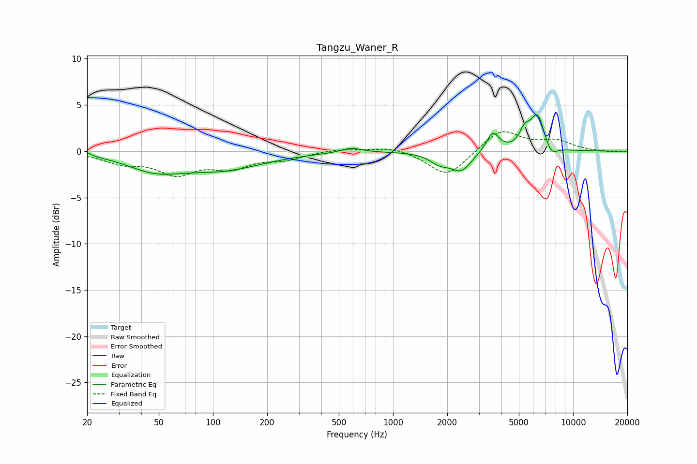

# Tangzu_Waner_R
See [usage instructions](https://github.com/jaakkopasanen/AutoEq#usage) for more options and info.

### Parametric EQs
Apply preamp of -4.1 dB when using parametric equalizer.

|   # | Type    |   Fc (Hz) |    Q |   Gain (dB) |
|-----|---------|-----------|------|-------------|
|   1 | Peaking |        20 | 5.92 |         0.4 |
|   2 | Peaking |        47 | 0.93 |        -1.7 |
|   3 | Peaking |       113 | 0.61 |        -1.8 |
|   4 | Peaking |       586 | 2.51 |         0.5 |
|   5 | Peaking |      1812 | 2.6  |        -1   |
|   6 | Peaking |      2387 | 2.45 |        -2   |
|   7 | Peaking |      3579 | 4.03 |         2.1 |
|   8 | Peaking |      5380 | 4.84 |         1.6 |
|   9 | Peaking |      6335 | 3.48 |         3.8 |
|  10 | Peaking |      7544 | 4    |        -1.2 |

### Fixed Band EQs
When using fixed band (also called graphic) equalizer, apply preamp of **-2.2 dB** (if available) and set gains manually with these parameters.

|   # | Type    |   Fc (Hz) |    Q |   Gain (dB) |
|-----|---------|-----------|------|-------------|
|   1 | Peaking |        31 | 1.41 |        -1.1 |
|   2 | Peaking |        62 | 1.41 |        -2.2 |
|   3 | Peaking |       125 | 1.41 |        -1.6 |
|   4 | Peaking |       250 | 1.41 |        -0.8 |
|   5 | Peaking |       500 | 1.41 |         0.3 |
|   6 | Peaking |      1000 | 1.41 |         0.5 |
|   7 | Peaking |      2000 | 1.41 |        -2.8 |
|   8 | Peaking |      4000 | 1.41 |         2.4 |
|   9 | Peaking |      8000 | 1.41 |         1   |
|  10 | Peaking |     16000 | 1.41 |        -0.1 |

### Graphs

