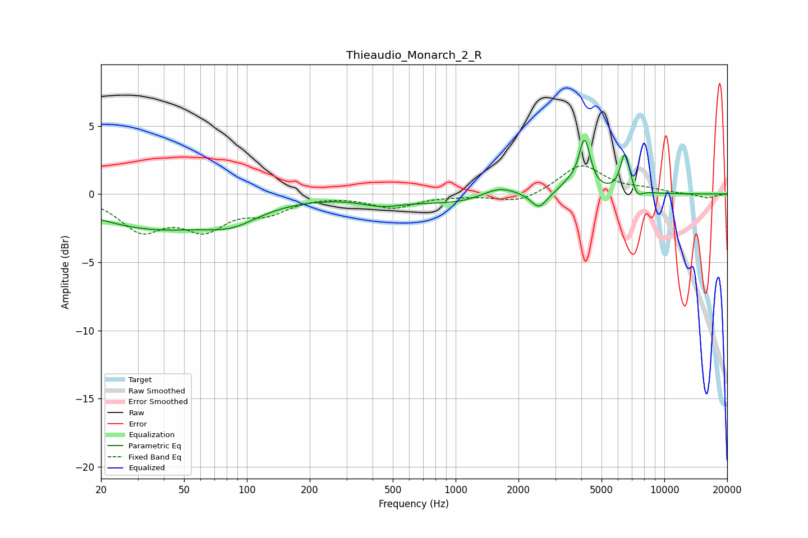

# Thieaudio_Monarch_2_R
See [usage instructions](https://github.com/jaakkopasanen/AutoEq#usage) for more options and info.

### Parametric EQs
Apply preamp of -4.0 dB when using parametric equalizer.

|   # | Type    |   Fc (Hz) |    Q |   Gain (dB) |
|-----|---------|-----------|------|-------------|
|   1 | Peaking |        36 | 0.45 |        -2.4 |
|   2 | Peaking |        85 | 1.1  |        -1.1 |
|   3 | Peaking |       445 | 1.38 |        -0.6 |
|   4 | Peaking |      1013 | 0.71 |        -0.7 |
|   5 | Peaking |      1617 | 1.67 |         0.8 |
|   6 | Peaking |      2507 | 3.83 |        -1.1 |
|   7 | Peaking |      3459 | 3.2  |         0.5 |
|   8 | Peaking |      4147 | 5.12 |         3.8 |
|   9 | Peaking |      6487 | 5.91 |         2.9 |
|  10 | Peaking |      7435 | 6    |        -0.6 |

### Fixed Band EQs
When using fixed band (also called graphic) equalizer, apply preamp of **-2.2 dB** (if available) and set gains manually with these parameters.

|   # | Type    |   Fc (Hz) |    Q |   Gain (dB) |
|-----|---------|-----------|------|-------------|
|   1 | Peaking |        31 | 1.41 |        -2.5 |
|   2 | Peaking |        62 | 1.41 |        -2.3 |
|   3 | Peaking |       125 | 1.41 |        -1.2 |
|   4 | Peaking |       250 | 1.41 |         0   |
|   5 | Peaking |       500 | 1.41 |        -1   |
|   6 | Peaking |      1000 | 1.41 |        -0.1 |
|   7 | Peaking |      2000 | 1.41 |        -0.7 |
|   8 | Peaking |      4000 | 1.41 |         2.1 |
|   9 | Peaking |      8000 | 1.41 |         0.3 |
|  10 | Peaking |     16000 | 1.41 |        -0.3 |

### Graphs

