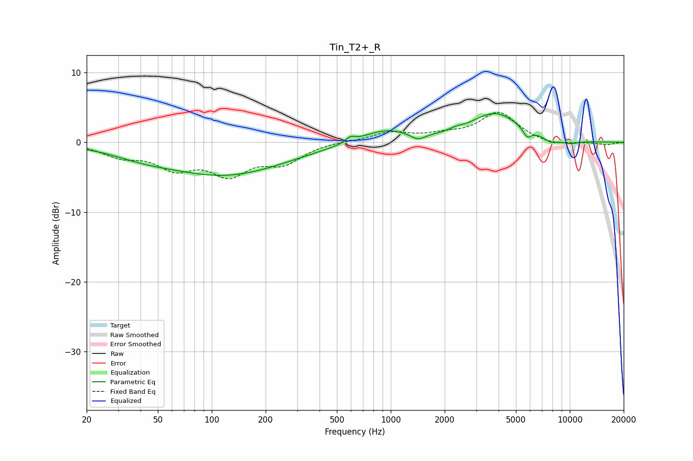

# Tin_T2+_R
See [usage instructions](https://github.com/jaakkopasanen/AutoEq#usage) for more options and info.

### Parametric EQs
Apply preamp of -4.2 dB when using parametric equalizer.

|   # | Type    |   Fc (Hz) |    Q |   Gain (dB) |
|-----|---------|-----------|------|-------------|
|   1 | Peaking |        40 | 0.85 |        -0.9 |
|   2 | Peaking |       119 | 0.42 |        -4.6 |
|   3 | Peaking |       595 | 5.68 |         0.7 |
|   4 | Peaking |       934 | 1.02 |         1.9 |
|   5 | Peaking |      1417 | 3.37 |        -1   |
|   6 | Peaking |      2314 | 4.11 |         0.3 |
|   7 | Peaking |      3831 | 1.02 |         4.1 |
|   8 | Peaking |      5777 | 6    |        -1.3 |
|   9 | Peaking |      7835 | 3.4  |        -0.7 |
|  10 | Peaking |     10000 | 2.36 |        -0.5 |

### Fixed Band EQs
When using fixed band (also called graphic) equalizer, apply preamp of **-4.4 dB** (if available) and set gains manually with these parameters.

|   # | Type    |   Fc (Hz) |    Q |   Gain (dB) |
|-----|---------|-----------|------|-------------|
|   1 | Peaking |        31 | 1.41 |        -1.7 |
|   2 | Peaking |        62 | 1.41 |        -3.2 |
|   3 | Peaking |       125 | 1.41 |        -4.1 |
|   4 | Peaking |       250 | 1.41 |        -2.7 |
|   5 | Peaking |       500 | 1.41 |         0.2 |
|   6 | Peaking |      1000 | 1.41 |         1.3 |
|   7 | Peaking |      2000 | 1.41 |         0.8 |
|   8 | Peaking |      4000 | 1.41 |         4.2 |
|   9 | Peaking |      8000 | 1.41 |        -0.5 |
|  10 | Peaking |     16000 | 1.41 |        -0.4 |

### Graphs

