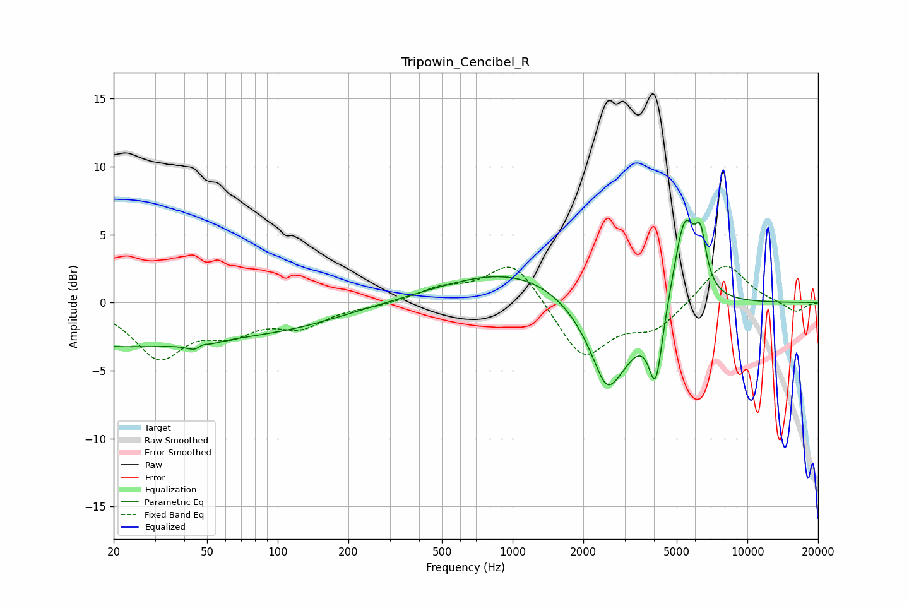

# Tripowin_Cencibel_R
See [usage instructions](https://github.com/jaakkopasanen/AutoEq#usage) for more options and info.

### Parametric EQs
Apply preamp of -6.2 dB when using parametric equalizer.

|   # | Type    |   Fc (Hz) |    Q |   Gain (dB) |
|-----|---------|-----------|------|-------------|
|   1 | Peaking |        20 | 0.27 |        -3.1 |
|   2 | Peaking |        47 | 4.11 |        -3   |
|   3 | Peaking |        47 | 4.66 |         2.7 |
|   4 | Peaking |       118 | 0.55 |        -1.1 |
|   5 | Peaking |      1047 | 0.47 |         2.5 |
|   6 | Peaking |      2494 | 3.45 |        -1.4 |
|   7 | Peaking |      2625 | 1.32 |        -6.1 |
|   8 | Peaking |      4068 | 4.74 |        -5.3 |
|   9 | Peaking |      5405 | 2.91 |         6.7 |
|  10 | Peaking |      6319 | 5.98 |         3.2 |

### Fixed Band EQs
When using fixed band (also called graphic) equalizer, apply preamp of **-2.8 dB** (if available) and set gains manually with these parameters.

|   # | Type    |   Fc (Hz) |    Q |   Gain (dB) |
|-----|---------|-----------|------|-------------|
|   1 | Peaking |        31 | 1.41 |        -3.8 |
|   2 | Peaking |        62 | 1.41 |        -1.8 |
|   3 | Peaking |       125 | 1.41 |        -1.6 |
|   4 | Peaking |       250 | 1.41 |        -0.2 |
|   5 | Peaking |       500 | 1.41 |         0.9 |
|   6 | Peaking |      1000 | 1.41 |         3.2 |
|   7 | Peaking |      2000 | 1.41 |        -4.1 |
|   8 | Peaking |      4000 | 1.41 |        -1.9 |
|   9 | Peaking |      8000 | 1.41 |         3.1 |
|  10 | Peaking |     16000 | 1.41 |        -0.8 |

### Graphs

