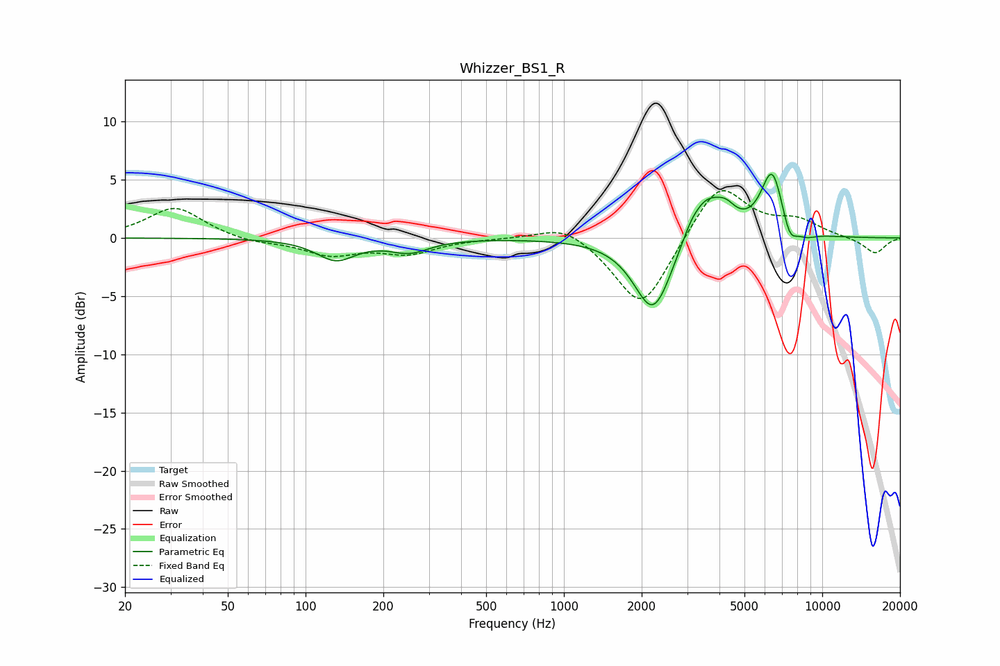

# Whizzer_BS1_R
See [usage instructions](https://github.com/jaakkopasanen/AutoEq#usage) for more options and info.

### Parametric EQs
Apply preamp of -5.6 dB when using parametric equalizer.

|   # | Type    |   Fc (Hz) |    Q |   Gain (dB) |
|-----|---------|-----------|------|-------------|
|   1 | Peaking |       131 | 1.87 |        -1.8 |
|   2 | Peaking |       252 | 1.85 |        -1.1 |
|   3 | Peaking |      2214 | 1.98 |        -5.6 |
|   4 | Peaking |      2272 | 1.55 |        -1.1 |
|   5 | Peaking |      3094 | 4.04 |         0.6 |
|   6 | Peaking |      3558 | 1.93 |         3.8 |
|   7 | Peaking |      4247 | 3.73 |         1   |
|   8 | Peaking |      6399 | 3.12 |         5.6 |
|   9 | Peaking |      7478 | 4.7  |        -1.9 |
|  10 | Peaking |      8671 | 3.35 |        -0.5 |

### Fixed Band EQs
When using fixed band (also called graphic) equalizer, apply preamp of **-4.2 dB** (if available) and set gains manually with these parameters.

|   # | Type    |   Fc (Hz) |    Q |   Gain (dB) |
|-----|---------|-----------|------|-------------|
|   1 | Peaking |        31 | 1.41 |         2.7 |
|   2 | Peaking |        62 | 1.41 |        -0.4 |
|   3 | Peaking |       125 | 1.41 |        -1.4 |
|   4 | Peaking |       250 | 1.41 |        -1.2 |
|   5 | Peaking |       500 | 1.41 |         0   |
|   6 | Peaking |      1000 | 1.41 |         1.4 |
|   7 | Peaking |      2000 | 1.41 |        -6.3 |
|   8 | Peaking |      4000 | 1.41 |         4.9 |
|   9 | Peaking |      8000 | 1.41 |         1.3 |
|  10 | Peaking |     16000 | 1.41 |        -1.4 |

### Graphs

