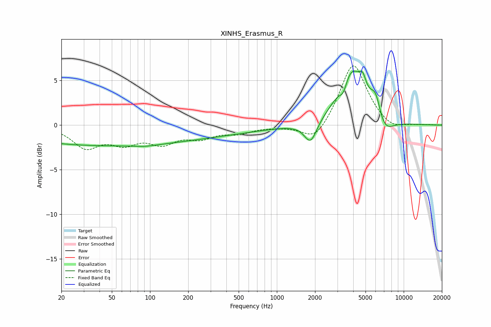

# XINHS_Erasmus_R
See [usage instructions](https://github.com/jaakkopasanen/AutoEq#usage) for more options and info.

### Parametric EQs
Apply preamp of -6.1 dB when using parametric equalizer.

|   # | Type    |   Fc (Hz) |    Q |   Gain (dB) |
|-----|---------|-----------|------|-------------|
|   1 | Peaking |        42 | 0.18 |        -2.3 |
|   2 | Peaking |        91 | 1.67 |        -0.2 |
|   3 | Peaking |       407 | 0.44 |        -0.6 |
|   4 | Peaking |      1625 | 0.75 |        -0.1 |
|   5 | Peaking |      1846 | 2.85 |        -2.5 |
|   6 | Peaking |      3349 | 4.42 |        -1.6 |
|   7 | Peaking |      3842 | 1.36 |         6.5 |
|   8 | Peaking |      4759 | 5.43 |         1.4 |
|   9 | Peaking |      6010 | 3.28 |         2.7 |
|  10 | Peaking |      6914 | 1.91 |        -2.2 |

### Fixed Band EQs
When using fixed band (also called graphic) equalizer, apply preamp of **-6.7 dB** (if available) and set gains manually with these parameters.

|   # | Type    |   Fc (Hz) |    Q |   Gain (dB) |
|-----|---------|-----------|------|-------------|
|   1 | Peaking |        31 | 1.41 |        -2.4 |
|   2 | Peaking |        62 | 1.41 |        -1.7 |
|   3 | Peaking |       125 | 1.41 |        -1.8 |
|   4 | Peaking |       250 | 1.41 |        -1.2 |
|   5 | Peaking |       500 | 1.41 |        -0.8 |
|   6 | Peaking |      1000 | 1.41 |        -0.1 |
|   7 | Peaking |      2000 | 1.41 |        -2.1 |
|   8 | Peaking |      4000 | 1.41 |         7.1 |
|   9 | Peaking |      8000 | 1.41 |        -0.8 |
|  10 | Peaking |     16000 | 1.41 |         0   |

### Graphs

