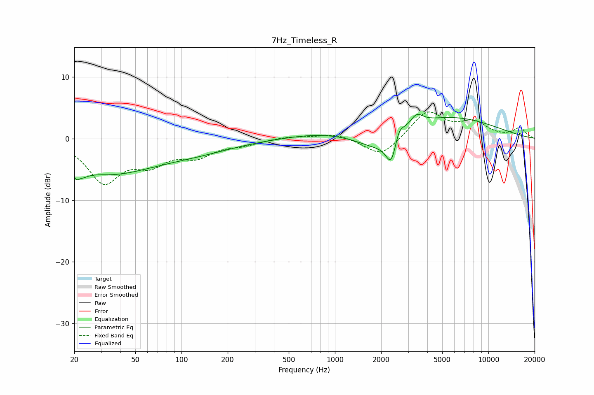

# 7Hz_Timeless_R
See [usage instructions](https://github.com/jaakkopasanen/AutoEq#usage) for more options and info.

### Parametric EQs
Apply preamp of -4.0 dB when using parametric equalizer.

|   # | Type    |   Fc (Hz) |    Q |   Gain (dB) |
|-----|---------|-----------|------|-------------|
|   1 | Peaking |        22 | 4.64 |        -5.1 |
|   2 | Peaking |        22 | 5.97 |         3.3 |
|   3 | Peaking |        33 | 0.47 |        -5.3 |
|   4 | Peaking |       123 | 0.53 |        -1.6 |
|   5 | Peaking |       811 | 0.64 |         0.8 |
|   6 | Peaking |      1900 | 1.05 |        -2.7 |
|   7 | Peaking |      2336 | 3.98 |        -4.6 |
|   8 | Peaking |      2606 | 4.54 |         2.3 |
|   9 | Peaking |      3399 | 3.38 |         1.9 |
|  10 | Peaking |      5387 | 0.43 |         3.6 |

### Fixed Band EQs
When using fixed band (also called graphic) equalizer, apply preamp of **-4.4 dB** (if available) and set gains manually with these parameters.

|   # | Type    |   Fc (Hz) |    Q |   Gain (dB) |
|-----|---------|-----------|------|-------------|
|   1 | Peaking |        31 | 1.41 |        -6.7 |
|   2 | Peaking |        62 | 1.41 |        -3.3 |
|   3 | Peaking |       125 | 1.41 |        -2.5 |
|   4 | Peaking |       250 | 1.41 |        -0.8 |
|   5 | Peaking |       500 | 1.41 |         0.4 |
|   6 | Peaking |      1000 | 1.41 |         0.9 |
|   7 | Peaking |      2000 | 1.41 |        -3.1 |
|   8 | Peaking |      4000 | 1.41 |         4.4 |
|   9 | Peaking |      8000 | 1.41 |         2.4 |
|  10 | Peaking |     16000 | 1.41 |         1.6 |

### Graphs

