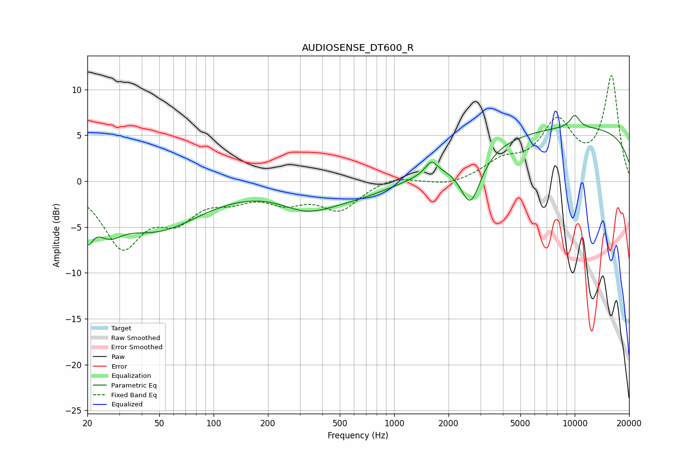

# AUDIOSENSE_DT600_R
See [usage instructions](https://github.com/jaakkopasanen/AutoEq#usage) for more options and info.

### Parametric EQs
Apply preamp of -7.3 dB when using parametric equalizer.

|   # | Type    |   Fc (Hz) |    Q |   Gain (dB) |
|-----|---------|-----------|------|-------------|
|   1 | Peaking |        20 | 4.59 |        -3.4 |
|   2 | Peaking |        26 | 2.01 |        -2.5 |
|   3 | Peaking |        47 | 0.56 |        -5.1 |
|   4 | Peaking |       337 | 1.07 |        -2.9 |
|   5 | Peaking |       349 | 1.36 |         0.9 |
|   6 | Peaking |       623 | 0.58 |        -1.6 |
|   7 | Peaking |      1606 | 4.36 |         1.4 |
|   8 | Peaking |      2648 | 2.46 |        -5.4 |
|   9 | Peaking |     10000 | 0.18 |         5.8 |
|  10 | Peaking |     10000 | 4.47 |         1.4 |

### Fixed Band EQs
When using fixed band (also called graphic) equalizer, apply preamp of **-11.6 dB** (if available) and set gains manually with these parameters.

|   # | Type    |   Fc (Hz) |    Q |   Gain (dB) |
|-----|---------|-----------|------|-------------|
|   1 | Peaking |        31 | 1.41 |        -6.8 |
|   2 | Peaking |        62 | 1.41 |        -3.4 |
|   3 | Peaking |       125 | 1.41 |        -1.5 |
|   4 | Peaking |       250 | 1.41 |        -1.9 |
|   5 | Peaking |       500 | 1.41 |        -2.9 |
|   6 | Peaking |      1000 | 1.41 |         0.7 |
|   7 | Peaking |      2000 | 1.41 |        -0.6 |
|   8 | Peaking |      4000 | 1.41 |         1.9 |
|   9 | Peaking |      8000 | 1.41 |         6   |
|  10 | Peaking |     16000 | 1.41 |        11.3 |

### Graphs

