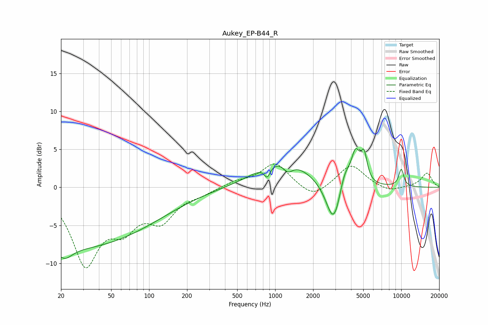

# Aukey_EP-B44_R
See [usage instructions](https://github.com/jaakkopasanen/AutoEq#usage) for more options and info.

### Parametric EQs
Apply preamp of -5.2 dB when using parametric equalizer.

|   # | Type    |   Fc (Hz) |    Q |   Gain (dB) |
|-----|---------|-----------|------|-------------|
|   1 | Peaking |        21 | 2.5  |        -1.4 |
|   2 | Peaking |        23 | 0.18 |        -8   |
|   3 | Peaking |       865 | 5.99 |        -1.5 |
|   4 | Peaking |      1154 | 0.73 |         3.9 |
|   5 | Peaking |      1262 | 3.42 |        -1.4 |
|   6 | Peaking |      2913 | 2.39 |        -5.9 |
|   7 | Peaking |      3547 | 3.35 |         2.6 |
|   8 | Peaking |      4342 | 3.93 |         4.2 |
|   9 | Peaking |      5070 | 5.73 |         3.4 |
|  10 | Peaking |     10000 | 6    |         2.3 |

### Fixed Band EQs
When using fixed band (also called graphic) equalizer, apply preamp of **-3.2 dB** (if available) and set gains manually with these parameters.

|   # | Type    |   Fc (Hz) |    Q |   Gain (dB) |
|-----|---------|-----------|------|-------------|
|   1 | Peaking |        31 | 1.41 |        -9.7 |
|   2 | Peaking |        62 | 1.41 |        -4.1 |
|   3 | Peaking |       125 | 1.41 |        -3.8 |
|   4 | Peaking |       250 | 1.41 |        -0.7 |
|   5 | Peaking |       500 | 1.41 |         0.7 |
|   6 | Peaking |      1000 | 1.41 |         3.2 |
|   7 | Peaking |      2000 | 1.41 |        -1.6 |
|   8 | Peaking |      4000 | 1.41 |         3   |
|   9 | Peaking |      8000 | 1.41 |        -0.7 |
|  10 | Peaking |     16000 | 1.41 |         1.9 |

### Graphs

