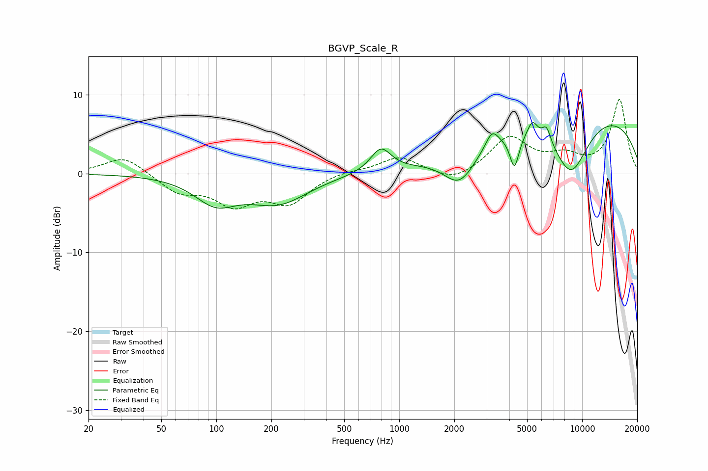

# BGVP_Scale_R
See [usage instructions](https://github.com/jaakkopasanen/AutoEq#usage) for more options and info.

### Parametric EQs
Apply preamp of -6.5 dB when using parametric equalizer.

|   # | Type    |   Fc (Hz) |    Q |   Gain (dB) |
|-----|---------|-----------|------|-------------|
|   1 | Peaking |        99 | 1.22 |        -3.3 |
|   2 | Peaking |       218 | 0.87 |        -3.5 |
|   3 | Peaking |       794 | 2.54 |         3   |
|   4 | Peaking |      2141 | 1.62 |        -4.2 |
|   5 | Peaking |      3216 | 4.12 |         2   |
|   6 | Peaking |      4264 | 5.57 |        -4.2 |
|   7 | Peaking |      5349 | 5.11 |         2   |
|   8 | Peaking |      6389 | 5.75 |         2   |
|   9 | Peaking |      8681 | 1.27 |        -7.7 |
|  10 | Peaking |      9620 | 0.22 |         8.2 |

### Fixed Band EQs
When using fixed band (also called graphic) equalizer, apply preamp of **-9.5 dB** (if available) and set gains manually with these parameters.

|   # | Type    |   Fc (Hz) |    Q |   Gain (dB) |
|-----|---------|-----------|------|-------------|
|   1 | Peaking |        31 | 1.41 |         2.3 |
|   2 | Peaking |        62 | 1.41 |        -2.2 |
|   3 | Peaking |       125 | 1.41 |        -3.5 |
|   4 | Peaking |       250 | 1.41 |        -3.5 |
|   5 | Peaking |       500 | 1.41 |         0.4 |
|   6 | Peaking |      1000 | 1.41 |         2.1 |
|   7 | Peaking |      2000 | 1.41 |        -1.3 |
|   8 | Peaking |      4000 | 1.41 |         4.5 |
|   9 | Peaking |      8000 | 1.41 |         1.8 |
|  10 | Peaking |     16000 | 1.41 |         9.3 |

### Graphs

