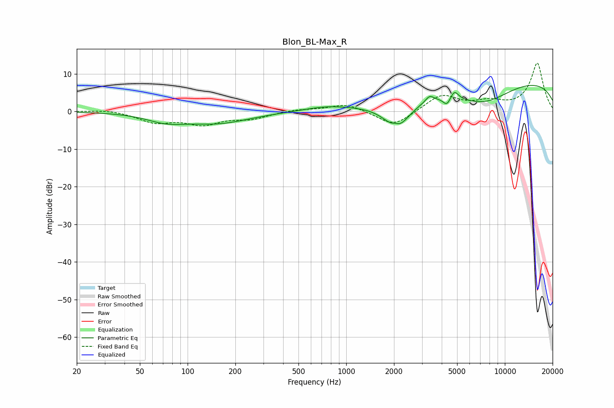

# Blon_BL-Max_R
See [usage instructions](https://github.com/jaakkopasanen/AutoEq#usage) for more options and info.

### Parametric EQs
Apply preamp of -7.0 dB when using parametric equalizer.

|   # | Type    |   Fc (Hz) |    Q |   Gain (dB) |
|-----|---------|-----------|------|-------------|
|   1 | Peaking |        73 | 1.17 |        -2.1 |
|   2 | Peaking |       155 | 0.69 |        -2.9 |
|   3 | Peaking |       743 | 1.01 |         1.1 |
|   4 | Peaking |      2039 | 5.96 |         0.9 |
|   5 | Peaking |      2088 | 1.71 |        -7.7 |
|   6 | Peaking |      3354 | 5.59 |         1.6 |
|   7 | Peaking |      4314 | 5.91 |        -2.2 |
|   8 | Peaking |      4802 | 5.6  |         2.5 |
|   9 | Peaking |      7340 | 0.74 |        -5.9 |
|  10 | Peaking |     10000 | 0.19 |         8.9 |

### Fixed Band EQs
When using fixed band (also called graphic) equalizer, apply preamp of **-12.9 dB** (if available) and set gains manually with these parameters.

|   # | Type    |   Fc (Hz) |    Q |   Gain (dB) |
|-----|---------|-----------|------|-------------|
|   1 | Peaking |        31 | 1.41 |         0.6 |
|   2 | Peaking |        62 | 1.41 |        -2.7 |
|   3 | Peaking |       125 | 1.41 |        -3.1 |
|   4 | Peaking |       250 | 1.41 |        -1.7 |
|   5 | Peaking |       500 | 1.41 |         0.6 |
|   6 | Peaking |      1000 | 1.41 |         2.1 |
|   7 | Peaking |      2000 | 1.41 |        -4.1 |
|   8 | Peaking |      4000 | 1.41 |         4.4 |
|   9 | Peaking |      8000 | 1.41 |         2.1 |
|  10 | Peaking |     16000 | 1.41 |        12.8 |

### Graphs

