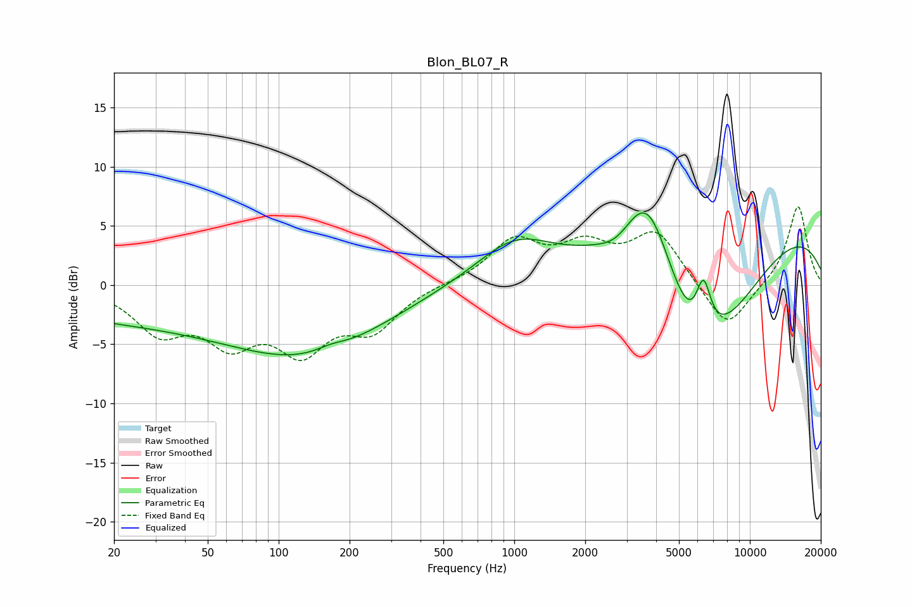

# Blon_BL07_R
See [usage instructions](https://github.com/jaakkopasanen/AutoEq#usage) for more options and info.

### Parametric EQs
Apply preamp of -6.2 dB when using parametric equalizer.

|   # | Type    |   Fc (Hz) |    Q |   Gain (dB) |
|-----|---------|-----------|------|-------------|
|   1 | Peaking |        40 | 0.18 |        -3.1 |
|   2 | Peaking |       142 | 0.45 |        -3.6 |
|   3 | Peaking |       166 | 2.24 |         0.5 |
|   4 | Peaking |      1007 | 0.85 |         3.5 |
|   5 | Peaking |      2718 | 1.94 |        -1.2 |
|   6 | Peaking |      3690 | 1.26 |         7.8 |
|   7 | Peaking |      5758 | 0.97 |        -7.3 |
|   8 | Peaking |      6353 | 4.22 |         4.6 |
|   9 | Peaking |      7864 | 0.63 |        -5.3 |
|  10 | Peaking |      9907 | 0.22 |         5.6 |

### Fixed Band EQs
When using fixed band (also called graphic) equalizer, apply preamp of **-6.7 dB** (if available) and set gains manually with these parameters.

|   # | Type    |   Fc (Hz) |    Q |   Gain (dB) |
|-----|---------|-----------|------|-------------|
|   1 | Peaking |        31 | 1.41 |        -3.6 |
|   2 | Peaking |        62 | 1.41 |        -4.1 |
|   3 | Peaking |       125 | 1.41 |        -4.9 |
|   4 | Peaking |       250 | 1.41 |        -3.4 |
|   5 | Peaking |       500 | 1.41 |         0.1 |
|   6 | Peaking |      1000 | 1.41 |         3.6 |
|   7 | Peaking |      2000 | 1.41 |         2.8 |
|   8 | Peaking |      4000 | 1.41 |         4.3 |
|   9 | Peaking |      8000 | 1.41 |        -4   |
|  10 | Peaking |     16000 | 1.41 |         6.8 |

### Graphs

