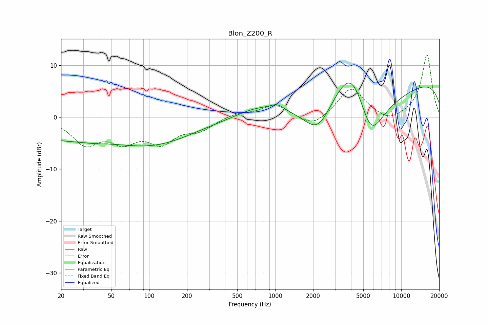

# Blon_Z200_R
See [usage instructions](https://github.com/jaakkopasanen/AutoEq#usage) for more options and info.

### Parametric EQs
Apply preamp of -6.7 dB when using parametric equalizer.

|   # | Type    |   Fc (Hz) |    Q |   Gain (dB) |
|-----|---------|-----------|------|-------------|
|   1 | Peaking |        29 | 0.22 |        -4.7 |
|   2 | Peaking |        36 | 1.67 |        -0.2 |
|   3 | Peaking |        56 | 0.46 |         0.9 |
|   4 | Peaking |       123 | 0.47 |        -3.2 |
|   5 | Peaking |       710 | 0.91 |         1.6 |
|   6 | Peaking |      1038 | 2.72 |         1.1 |
|   7 | Peaking |      2192 | 1.13 |        -7.6 |
|   8 | Peaking |      4087 | 0.75 |        14.9 |
|   9 | Peaking |      5692 | 0.78 |       -18.7 |
|  10 | Peaking |     10000 | 0.18 |         8.3 |

### Fixed Band EQs
When using fixed band (also called graphic) equalizer, apply preamp of **-12.1 dB** (if available) and set gains manually with these parameters.

|   # | Type    |   Fc (Hz) |    Q |   Gain (dB) |
|-----|---------|-----------|------|-------------|
|   1 | Peaking |        31 | 1.41 |        -4.8 |
|   2 | Peaking |        62 | 1.41 |        -3.9 |
|   3 | Peaking |       125 | 1.41 |        -4.4 |
|   4 | Peaking |       250 | 1.41 |        -2.2 |
|   5 | Peaking |       500 | 1.41 |         0.8 |
|   6 | Peaking |      1000 | 1.41 |         2.4 |
|   7 | Peaking |      2000 | 1.41 |        -2.1 |
|   8 | Peaking |      4000 | 1.41 |         5.7 |
|   9 | Peaking |      8000 | 1.41 |        -1.3 |
|  10 | Peaking |     16000 | 1.41 |        12.1 |

### Graphs

