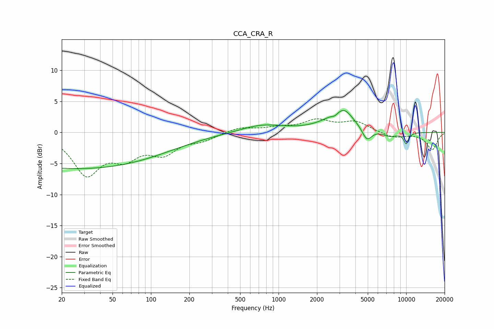

# CCA_CRA_R
See [usage instructions](https://github.com/jaakkopasanen/AutoEq#usage) for more options and info.

### Parametric EQs
Apply preamp of -3.6 dB when using parametric equalizer.

|   # | Type    |   Fc (Hz) |    Q |   Gain (dB) |
|-----|---------|-----------|------|-------------|
|   1 | Peaking |        26 | 0.18 |        -5.8 |
|   2 | Peaking |       745 | 0.84 |         1.2 |
|   3 | Peaking |      2757 | 5.99 |        -0.5 |
|   4 | Peaking |      3058 | 1.11 |         2.8 |
|   5 | Peaking |      3299 | 2.78 |         1   |
|   6 | Peaking |      3860 | 3.71 |        -0   |
|   7 | Peaking |      4919 | 3.55 |        -2.2 |
|   8 | Peaking |      7440 | 2.1  |        -0.8 |
|   9 | Peaking |     10000 | 5.97 |        -0.8 |
|  10 | Peaking |     10000 | 5.99 |        -1   |

### Fixed Band EQs
When using fixed band (also called graphic) equalizer, apply preamp of **-2.3 dB** (if available) and set gains manually with these parameters.

|   # | Type    |   Fc (Hz) |    Q |   Gain (dB) |
|-----|---------|-----------|------|-------------|
|   1 | Peaking |        31 | 1.41 |        -6.4 |
|   2 | Peaking |        62 | 1.41 |        -3.3 |
|   3 | Peaking |       125 | 1.41 |        -3   |
|   4 | Peaking |       250 | 1.41 |        -1.1 |
|   5 | Peaking |       500 | 1.41 |         0.8 |
|   6 | Peaking |      1000 | 1.41 |         0.6 |
|   7 | Peaking |      2000 | 1.41 |         1.8 |
|   8 | Peaking |      4000 | 1.41 |         1.6 |
|   9 | Peaking |      8000 | 1.41 |        -0.9 |
|  10 | Peaking |     16000 | 1.41 |        -2.8 |

### Graphs

