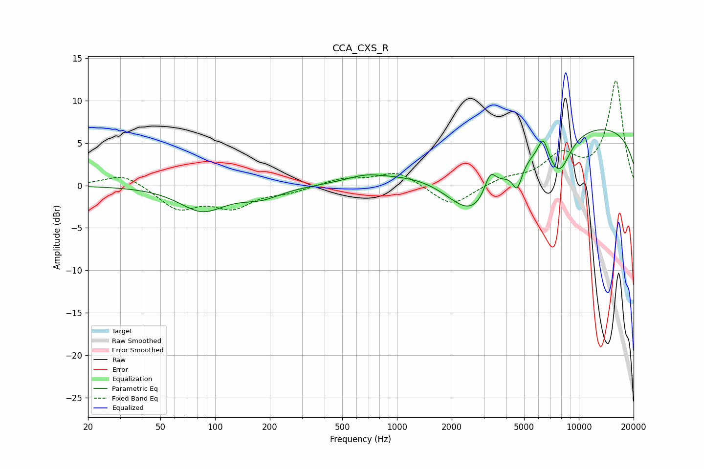

# CCA_CXS_R
See [usage instructions](https://github.com/jaakkopasanen/AutoEq#usage) for more options and info.

### Parametric EQs
Apply preamp of -6.7 dB when using parametric equalizer.

|   # | Type    |   Fc (Hz) |    Q |   Gain (dB) |
|-----|---------|-----------|------|-------------|
|   1 | Peaking |        85 | 1.13 |        -2.9 |
|   2 | Peaking |       179 | 1.27 |        -1.2 |
|   3 | Peaking |       669 | 1.38 |         0.7 |
|   4 | Peaking |      1568 | 0.53 |         1.7 |
|   5 | Peaking |      2644 | 0.82 |        -8.4 |
|   6 | Peaking |      3257 | 4.28 |         2.7 |
|   7 | Peaking |      4582 | 5.23 |        -2.7 |
|   8 | Peaking |      6363 | 5.17 |         2.3 |
|   9 | Peaking |      7806 | 2.13 |        -4.4 |
|  10 | Peaking |     10000 | 0.18 |         7.3 |

### Fixed Band EQs
When using fixed band (also called graphic) equalizer, apply preamp of **-12.4 dB** (if available) and set gains manually with these parameters.

|   # | Type    |   Fc (Hz) |    Q |   Gain (dB) |
|-----|---------|-----------|------|-------------|
|   1 | Peaking |        31 | 1.41 |         1.5 |
|   2 | Peaking |        62 | 1.41 |        -2.7 |
|   3 | Peaking |       125 | 1.41 |        -2.4 |
|   4 | Peaking |       250 | 1.41 |        -0.7 |
|   5 | Peaking |       500 | 1.41 |         0.8 |
|   6 | Peaking |      1000 | 1.41 |         1.7 |
|   7 | Peaking |      2000 | 1.41 |        -2.5 |
|   8 | Peaking |      4000 | 1.41 |         0.8 |
|   9 | Peaking |      8000 | 1.41 |         3.3 |
|  10 | Peaking |     16000 | 1.41 |        12.3 |

### Graphs

