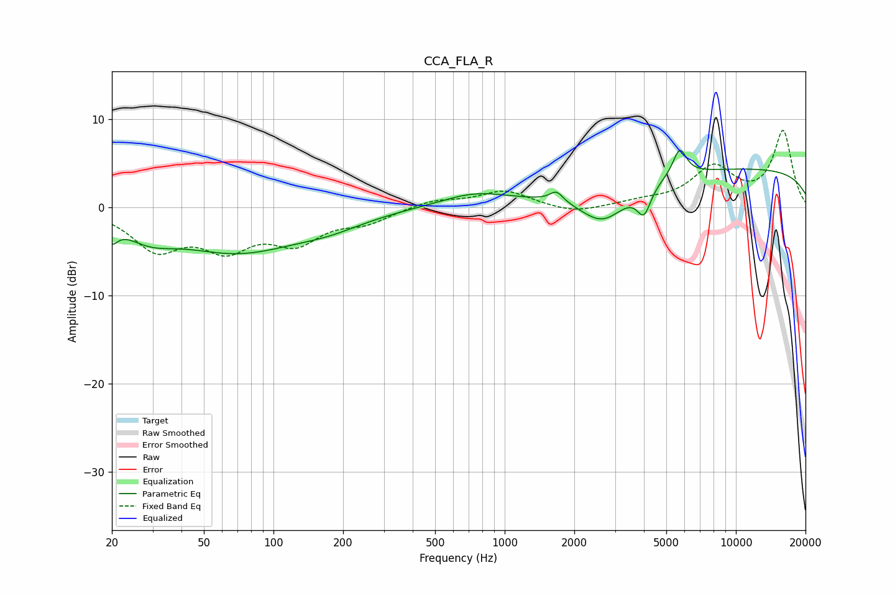

# CCA_FLA_R
See [usage instructions](https://github.com/jaakkopasanen/AutoEq#usage) for more options and info.

### Parametric EQs
Apply preamp of -6.5 dB when using parametric equalizer.

|   # | Type    |   Fc (Hz) |    Q |   Gain (dB) |
|-----|---------|-----------|------|-------------|
|   1 | Peaking |        20 | 5.67 |        -1.8 |
|   2 | Peaking |        29 | 1.29 |        -2   |
|   3 | Peaking |        70 | 0.51 |        -4.8 |
|   4 | Peaking |       177 | 0.92 |        -1.1 |
|   5 | Peaking |       740 | 0.96 |         1.4 |
|   6 | Peaking |      1675 | 5.01 |         1.2 |
|   7 | Peaking |      2657 | 1.4  |        -4.1 |
|   8 | Peaking |      4004 | 4.73 |        -3   |
|   9 | Peaking |      5713 | 4.66 |         3.1 |
|  10 | Peaking |     10000 | 0.18 |         4.4 |

### Fixed Band EQs
When using fixed band (also called graphic) equalizer, apply preamp of **-8.8 dB** (if available) and set gains manually with these parameters.

|   # | Type    |   Fc (Hz) |    Q |   Gain (dB) |
|-----|---------|-----------|------|-------------|
|   1 | Peaking |        31 | 1.41 |        -4.4 |
|   2 | Peaking |        62 | 1.41 |        -4   |
|   3 | Peaking |       125 | 1.41 |        -3.5 |
|   4 | Peaking |       250 | 1.41 |        -1.5 |
|   5 | Peaking |       500 | 1.41 |         0.8 |
|   6 | Peaking |      1000 | 1.41 |         1.8 |
|   7 | Peaking |      2000 | 1.41 |        -0.8 |
|   8 | Peaking |      4000 | 1.41 |         0.5 |
|   9 | Peaking |      8000 | 1.41 |         4.3 |
|  10 | Peaking |     16000 | 1.41 |         8.5 |

### Graphs

