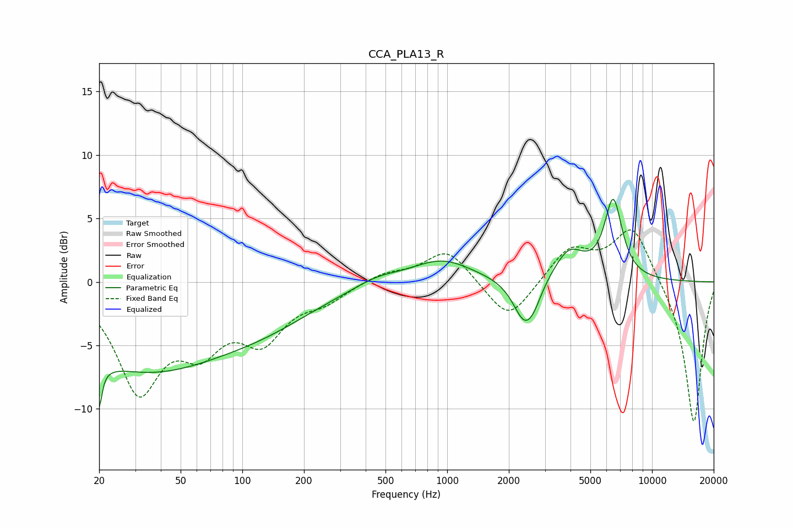

# CCA_PLA13_R
See [usage instructions](https://github.com/jaakkopasanen/AutoEq#usage) for more options and info.

### Parametric EQs
Apply preamp of -6.6 dB when using parametric equalizer.

|   # | Type    |   Fc (Hz) |    Q |   Gain (dB) |
|-----|---------|-----------|------|-------------|
|   1 | Peaking |        20 | 5.86 |        -7   |
|   2 | Peaking |        20 | 5.83 |         3.3 |
|   3 | Peaking |        33 | 0.34 |        -6.7 |
|   4 | Peaking |       137 | 0.56 |        -1.8 |
|   5 | Peaking |       454 | 1.29 |         0.6 |
|   6 | Peaking |       939 | 0.96 |         1.8 |
|   7 | Peaking |      2384 | 2.53 |        -3.3 |
|   8 | Peaking |      2651 | 3.53 |        -0.9 |
|   9 | Peaking |      3933 | 1.89 |         2.4 |
|  10 | Peaking |      6465 | 3.16 |         6.1 |

### Fixed Band EQs
When using fixed band (also called graphic) equalizer, apply preamp of **-4.2 dB** (if available) and set gains manually with these parameters.

|   # | Type    |   Fc (Hz) |    Q |   Gain (dB) |
|-----|---------|-----------|------|-------------|
|   1 | Peaking |        31 | 1.41 |        -8.1 |
|   2 | Peaking |        62 | 1.41 |        -4.1 |
|   3 | Peaking |       125 | 1.41 |        -4   |
|   4 | Peaking |       250 | 1.41 |        -1.2 |
|   5 | Peaking |       500 | 1.41 |         0.7 |
|   6 | Peaking |      1000 | 1.41 |         2.6 |
|   7 | Peaking |      2000 | 1.41 |        -3.3 |
|   8 | Peaking |      4000 | 1.41 |         2.6 |
|   9 | Peaking |      8000 | 1.41 |         4.4 |
|  10 | Peaking |     16000 | 1.41 |       -11.3 |

### Graphs

