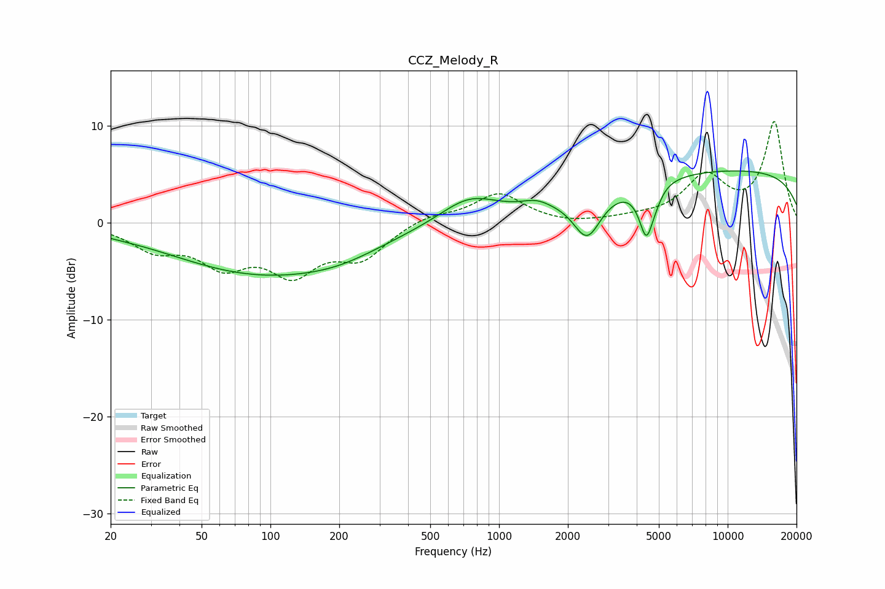

# CCZ_Melody_R
See [usage instructions](https://github.com/jaakkopasanen/AutoEq#usage) for more options and info.

### Parametric EQs
Apply preamp of -5.4 dB when using parametric equalizer.

|   # | Type    |   Fc (Hz) |    Q |   Gain (dB) |
|-----|---------|-----------|------|-------------|
|   1 | Peaking |        22 | 1.65 |        -0.1 |
|   2 | Peaking |        91 | 0.36 |        -5.1 |
|   3 | Peaking |       203 | 0.79 |        -0.9 |
|   4 | Peaking |       739 | 1.11 |         2.6 |
|   5 | Peaking |      1454 | 2.31 |         0.7 |
|   6 | Peaking |      2429 | 2.34 |        -4.5 |
|   7 | Peaking |      3951 | 4.9  |        -0.1 |
|   8 | Peaking |      4412 | 4.5  |        -5.2 |
|   9 | Peaking |      4888 | 5.3  |        -0.6 |
|  10 | Peaking |     10000 | 0.18 |         5.4 |

### Fixed Band EQs
When using fixed band (also called graphic) equalizer, apply preamp of **-10.5 dB** (if available) and set gains manually with these parameters.

|   # | Type    |   Fc (Hz) |    Q |   Gain (dB) |
|-----|---------|-----------|------|-------------|
|   1 | Peaking |        31 | 1.41 |        -2.4 |
|   2 | Peaking |        62 | 1.41 |        -3.8 |
|   3 | Peaking |       125 | 1.41 |        -4.6 |
|   4 | Peaking |       250 | 1.41 |        -3.3 |
|   5 | Peaking |       500 | 1.41 |         0.8 |
|   6 | Peaking |      1000 | 1.41 |         3   |
|   7 | Peaking |      2000 | 1.41 |        -0.3 |
|   8 | Peaking |      4000 | 1.41 |         0.3 |
|   9 | Peaking |      8000 | 1.41 |         4.5 |
|  10 | Peaking |     16000 | 1.41 |        10.3 |

### Graphs

