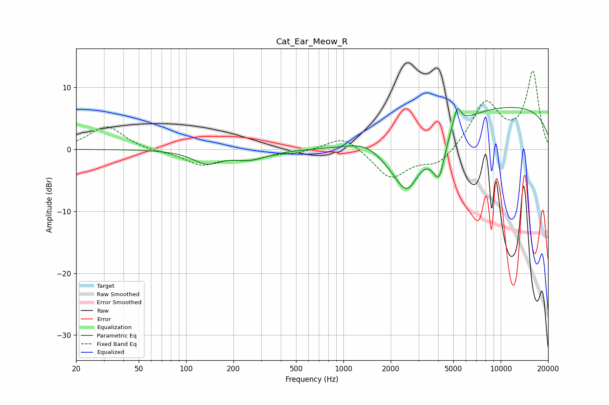

# Cat_Ear_Meow_R
See [usage instructions](https://github.com/jaakkopasanen/AutoEq#usage) for more options and info.

### Parametric EQs
Apply preamp of -6.9 dB when using parametric equalizer.

|   # | Type    |   Fc (Hz) |    Q |   Gain (dB) |
|-----|---------|-----------|------|-------------|
|   1 | Peaking |       135 | 1.61 |        -2.1 |
|   2 | Peaking |       257 | 1.27 |        -1.5 |
|   3 | Peaking |      1404 | 1.15 |         1.9 |
|   4 | Peaking |      2501 | 0.97 |        -8.5 |
|   5 | Peaking |      2537 | 2.68 |        -2.2 |
|   6 | Peaking |      3744 | 4.01 |        -1.4 |
|   7 | Peaking |      4067 | 4.61 |        -4.7 |
|   8 | Peaking |      4374 | 5.97 |        -0.7 |
|   9 | Peaking |      5289 | 5.74 |         3.2 |
|  10 | Peaking |      9902 | 0.19 |         7.1 |

### Fixed Band EQs
When using fixed band (also called graphic) equalizer, apply preamp of **-12.7 dB** (if available) and set gains manually with these parameters.

|   # | Type    |   Fc (Hz) |    Q |   Gain (dB) |
|-----|---------|-----------|------|-------------|
|   1 | Peaking |        31 | 1.41 |         3.8 |
|   2 | Peaking |        62 | 1.41 |        -0.3 |
|   3 | Peaking |       125 | 1.41 |        -2.4 |
|   4 | Peaking |       250 | 1.41 |        -1.4 |
|   5 | Peaking |       500 | 1.41 |        -0.5 |
|   6 | Peaking |      1000 | 1.41 |         2.4 |
|   7 | Peaking |      2000 | 1.41 |        -4.7 |
|   8 | Peaking |      4000 | 1.41 |        -2.6 |
|   9 | Peaking |      8000 | 1.41 |         7.5 |
|  10 | Peaking |     16000 | 1.41 |        12.4 |

### Graphs

