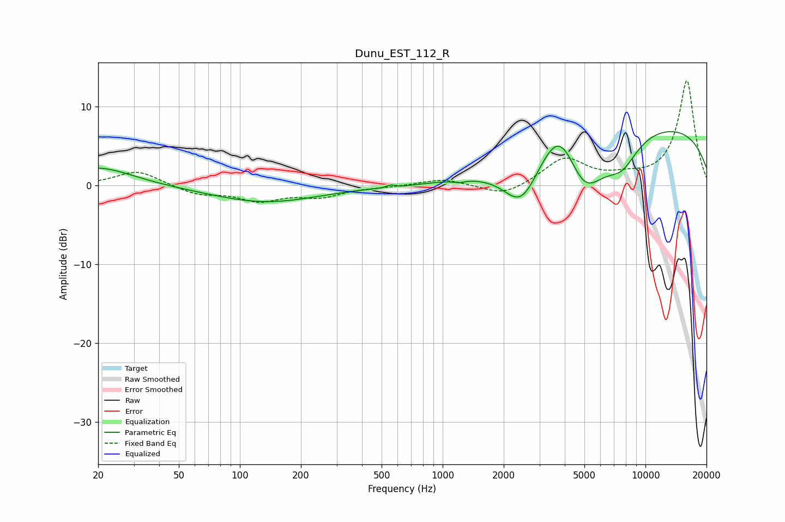

# Dunu_EST_112_R
See [usage instructions](https://github.com/jaakkopasanen/AutoEq#usage) for more options and info.

### Parametric EQs
Apply preamp of -6.9 dB when using parametric equalizer.

|   # | Type    |   Fc (Hz) |    Q |   Gain (dB) |
|-----|---------|-----------|------|-------------|
|   1 | Peaking |        20 | 0.85 |         2.4 |
|   2 | Peaking |       133 | 0.53 |        -2.1 |
|   3 | Peaking |       555 | 5.99 |         0.4 |
|   4 | Peaking |       570 | 2.19 |        -0.2 |
|   5 | Peaking |      1206 | 5.79 |        -0.3 |
|   6 | Peaking |      2445 | 1.58 |        -5.8 |
|   7 | Peaking |      3797 | 1.47 |         6.6 |
|   8 | Peaking |      4968 | 1.28 |        -8.1 |
|   9 | Peaking |      7643 | 1.64 |        -3.5 |
|  10 | Peaking |     10000 | 0.21 |         7.9 |

### Fixed Band EQs
When using fixed band (also called graphic) equalizer, apply preamp of **-13.4 dB** (if available) and set gains manually with these parameters.

|   # | Type    |   Fc (Hz) |    Q |   Gain (dB) |
|-----|---------|-----------|------|-------------|
|   1 | Peaking |        31 | 1.41 |         1.9 |
|   2 | Peaking |        62 | 1.41 |        -1.1 |
|   3 | Peaking |       125 | 1.41 |        -1.8 |
|   4 | Peaking |       250 | 1.41 |        -1.3 |
|   5 | Peaking |       500 | 1.41 |        -0.1 |
|   6 | Peaking |      1000 | 1.41 |         0.9 |
|   7 | Peaking |      2000 | 1.41 |        -1.5 |
|   8 | Peaking |      4000 | 1.41 |         3.4 |
|   9 | Peaking |      8000 | 1.41 |         0.7 |
|  10 | Peaking |     16000 | 1.41 |        13.3 |

### Graphs

