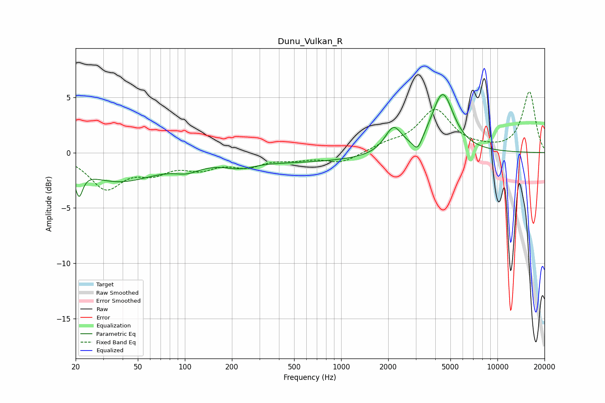

# Dunu_Vulkan_R
See [usage instructions](https://github.com/jaakkopasanen/AutoEq#usage) for more options and info.

### Parametric EQs
Apply preamp of -5.3 dB when using parametric equalizer.

|   # | Type    |   Fc (Hz) |    Q |   Gain (dB) |
|-----|---------|-----------|------|-------------|
|   1 | Peaking |        21 | 5.94 |        -2.3 |
|   2 | Peaking |        37 | 0.6  |        -2.5 |
|   3 | Peaking |       103 | 1.8  |        -0.6 |
|   4 | Peaking |       225 | 2.91 |         1   |
|   5 | Peaking |       226 | 2.43 |        -1.4 |
|   6 | Peaking |       455 | 0.24 |        -0.9 |
|   7 | Peaking |      2063 | 2.28 |         0.5 |
|   8 | Peaking |      2173 | 2.83 |         1.8 |
|   9 | Peaking |      3083 | 4.69 |        -1.2 |
|  10 | Peaking |      4460 | 2.01 |         5.3 |

### Fixed Band EQs
When using fixed band (also called graphic) equalizer, apply preamp of **-5.6 dB** (if available) and set gains manually with these parameters.

|   # | Type    |   Fc (Hz) |    Q |   Gain (dB) |
|-----|---------|-----------|------|-------------|
|   1 | Peaking |        31 | 1.41 |        -3.1 |
|   2 | Peaking |        62 | 1.41 |        -1.4 |
|   3 | Peaking |       125 | 1.41 |        -1.2 |
|   4 | Peaking |       250 | 1.41 |        -1   |
|   5 | Peaking |       500 | 1.41 |        -0.5 |
|   6 | Peaking |      1000 | 1.41 |        -0.9 |
|   7 | Peaking |      2000 | 1.41 |         0.6 |
|   8 | Peaking |      4000 | 1.41 |         3.7 |
|   9 | Peaking |      8000 | 1.41 |         0.2 |
|  10 | Peaking |     16000 | 1.41 |         5.5 |

### Graphs

