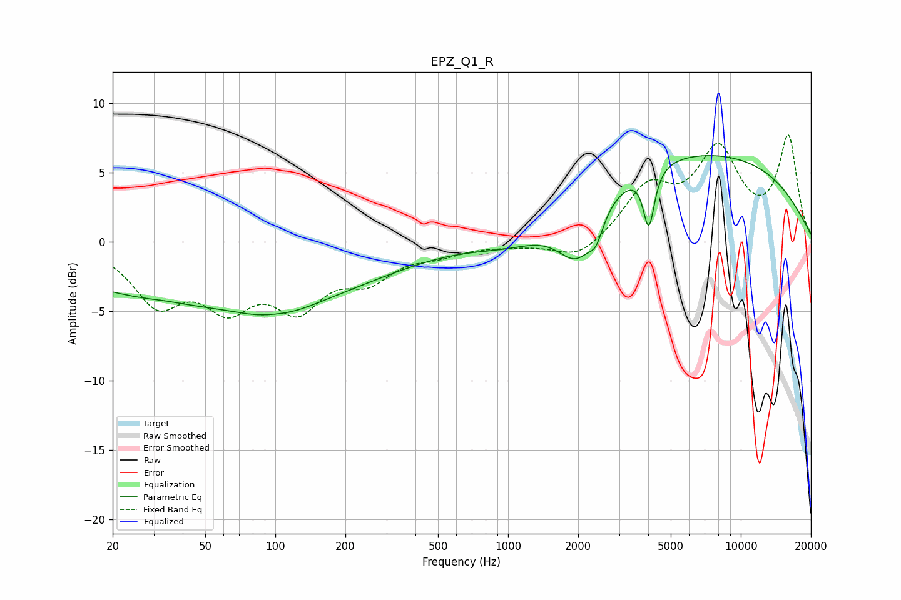

# EPZ_Q1_R
See [usage instructions](https://github.com/jaakkopasanen/AutoEq#usage) for more options and info.

### Parametric EQs
Apply preamp of -6.3 dB when using parametric equalizer.

|   # | Type    |   Fc (Hz) |    Q |   Gain (dB) |
|-----|---------|-----------|------|-------------|
|   1 | Peaking |        34 | 2.61 |         0.1 |
|   2 | Peaking |        57 | 0.18 |        -4.4 |
|   3 | Peaking |       101 | 0.92 |        -1.2 |
|   4 | Peaking |       101 | 2.13 |         0.2 |
|   5 | Peaking |      1077 | 0.77 |        -1.9 |
|   6 | Peaking |      2004 | 1.49 |        -4.8 |
|   7 | Peaking |      2385 | 3.59 |         1.4 |
|   8 | Peaking |      2388 | 4.31 |        -2.6 |
|   9 | Peaking |      4026 | 5.92 |        -4.2 |
|  10 | Peaking |      5749 | 0.21 |         6.6 |

### Fixed Band EQs
When using fixed band (also called graphic) equalizer, apply preamp of **-7.8 dB** (if available) and set gains manually with these parameters.

|   # | Type    |   Fc (Hz) |    Q |   Gain (dB) |
|-----|---------|-----------|------|-------------|
|   1 | Peaking |        31 | 1.41 |        -4.1 |
|   2 | Peaking |        62 | 1.41 |        -3.9 |
|   3 | Peaking |       125 | 1.41 |        -4.1 |
|   4 | Peaking |       250 | 1.41 |        -2.3 |
|   5 | Peaking |       500 | 1.41 |        -0.7 |
|   6 | Peaking |      1000 | 1.41 |        -0.2 |
|   7 | Peaking |      2000 | 1.41 |        -1.4 |
|   8 | Peaking |      4000 | 1.41 |         3.6 |
|   9 | Peaking |      8000 | 1.41 |         6.2 |
|  10 | Peaking |     16000 | 1.41 |         7.4 |

### Graphs

