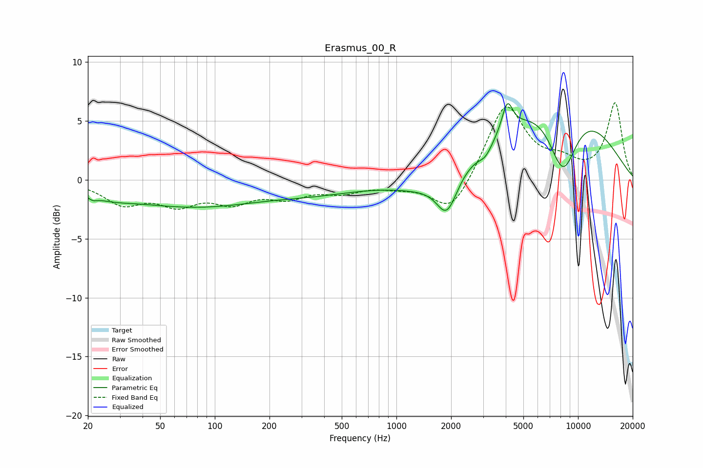

# Erasmus_00_R
See [usage instructions](https://github.com/jaakkopasanen/AutoEq#usage) for more options and info.

### Parametric EQs
Apply preamp of -6.6 dB when using parametric equalizer.

|   # | Type    |   Fc (Hz) |    Q |   Gain (dB) |
|-----|---------|-----------|------|-------------|
|   1 | Peaking |        21 | 5.81 |        -0.3 |
|   2 | Peaking |        26 | 1.12 |        -0.6 |
|   3 | Peaking |       122 | 0.25 |        -2.7 |
|   4 | Peaking |       198 | 0.56 |         0.8 |
|   5 | Peaking |      1431 | 0.84 |        -1.1 |
|   6 | Peaking |      1897 | 2.48 |        -3.3 |
|   7 | Peaking |      3092 | 3.62 |        -0.9 |
|   8 | Peaking |      4080 | 4.77 |         2.5 |
|   9 | Peaking |      7739 | 0.43 |         8   |
|  10 | Peaking |      8251 | 1.53 |        -6.7 |

### Fixed Band EQs
When using fixed band (also called graphic) equalizer, apply preamp of **-6.6 dB** (if available) and set gains manually with these parameters.

|   # | Type    |   Fc (Hz) |    Q |   Gain (dB) |
|-----|---------|-----------|------|-------------|
|   1 | Peaking |        31 | 1.41 |        -1.9 |
|   2 | Peaking |        62 | 1.41 |        -1.8 |
|   3 | Peaking |       125 | 1.41 |        -1.6 |
|   4 | Peaking |       250 | 1.41 |        -1.3 |
|   5 | Peaking |       500 | 1.41 |        -0.9 |
|   6 | Peaking |      1000 | 1.41 |        -0.4 |
|   7 | Peaking |      2000 | 1.41 |        -3   |
|   8 | Peaking |      4000 | 1.41 |         6.5 |
|   9 | Peaking |      8000 | 1.41 |         1.2 |
|  10 | Peaking |     16000 | 1.41 |         6.5 |

### Graphs

