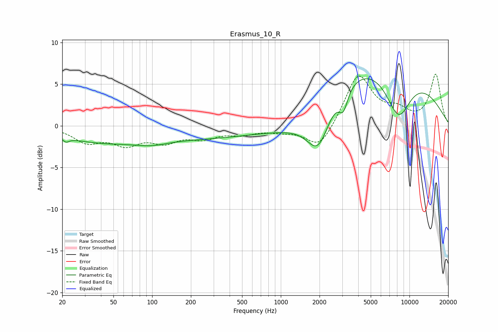

# Erasmus_10_R
See [usage instructions](https://github.com/jaakkopasanen/AutoEq#usage) for more options and info.

### Parametric EQs
Apply preamp of -5.7 dB when using parametric equalizer.

|   # | Type    |   Fc (Hz) |    Q |   Gain (dB) |
|-----|---------|-----------|------|-------------|
|   1 | Peaking |        21 | 5.8  |        -0.5 |
|   2 | Peaking |        38 | 0.44 |        -1.7 |
|   3 | Peaking |        99 | 1.2  |        -0.5 |
|   4 | Peaking |       317 | 0.25 |        -1.5 |
|   5 | Peaking |      1125 | 0.65 |        -1.5 |
|   6 | Peaking |      1647 | 0.81 |        -1.6 |
|   7 | Peaking |      1962 | 1.56 |        -5.4 |
|   8 | Peaking |      3065 | 4.05 |        -2.4 |
|   9 | Peaking |      5013 | 0.23 |         8.3 |
|  10 | Peaking |      8203 | 1.31 |        -6   |

### Fixed Band EQs
When using fixed band (also called graphic) equalizer, apply preamp of **-6.3 dB** (if available) and set gains manually with these parameters.

|   # | Type    |   Fc (Hz) |    Q |   Gain (dB) |
|-----|---------|-----------|------|-------------|
|   1 | Peaking |        31 | 1.41 |        -1.8 |
|   2 | Peaking |        62 | 1.41 |        -1.9 |
|   3 | Peaking |       125 | 1.41 |        -1.6 |
|   4 | Peaking |       250 | 1.41 |        -1.2 |
|   5 | Peaking |       500 | 1.41 |        -0.8 |
|   6 | Peaking |      1000 | 1.41 |        -0.5 |
|   7 | Peaking |      2000 | 1.41 |        -2.9 |
|   8 | Peaking |      4000 | 1.41 |         6.2 |
|   9 | Peaking |      8000 | 1.41 |         1.5 |
|  10 | Peaking |     16000 | 1.41 |         6.1 |

### Graphs

