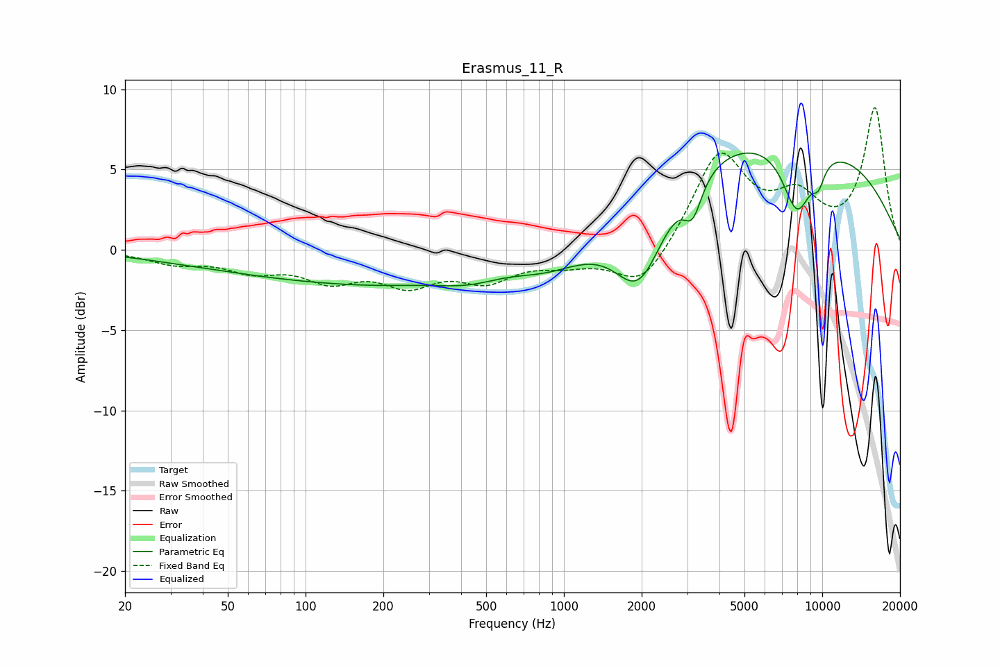

# Erasmus_11_R
See [usage instructions](https://github.com/jaakkopasanen/AutoEq#usage) for more options and info.

### Parametric EQs
Apply preamp of -6.1 dB when using parametric equalizer.

|   # | Type    |   Fc (Hz) |    Q |   Gain (dB) |
|-----|---------|-----------|------|-------------|
|   1 | Peaking |        31 | 1.25 |        -0.1 |
|   2 | Peaking |       141 | 0.27 |        -1.9 |
|   3 | Peaking |       313 | 0.82 |         0.8 |
|   4 | Peaking |       609 | 0.96 |         2   |
|   5 | Peaking |       689 | 0.49 |        -4.7 |
|   6 | Peaking |      1963 | 1.39 |        -5.8 |
|   7 | Peaking |      3153 | 3.97 |        -2.3 |
|   8 | Peaking |      5523 | 0.2  |         7.6 |
|   9 | Peaking |      7995 | 2.27 |        -4.4 |
|  10 | Peaking |      9666 | 5.08 |        -1.3 |

### Fixed Band EQs
When using fixed band (also called graphic) equalizer, apply preamp of **-8.9 dB** (if available) and set gains manually with these parameters.

|   # | Type    |   Fc (Hz) |    Q |   Gain (dB) |
|-----|---------|-----------|------|-------------|
|   1 | Peaking |        31 | 1.41 |        -0.7 |
|   2 | Peaking |        62 | 1.41 |        -1.1 |
|   3 | Peaking |       125 | 1.41 |        -1.6 |
|   4 | Peaking |       250 | 1.41 |        -1.9 |
|   5 | Peaking |       500 | 1.41 |        -1.7 |
|   6 | Peaking |      1000 | 1.41 |        -0.7 |
|   7 | Peaking |      2000 | 1.41 |        -2.5 |
|   8 | Peaking |      4000 | 1.41 |         6   |
|   9 | Peaking |      8000 | 1.41 |         2.7 |
|  10 | Peaking |     16000 | 1.41 |         8.7 |

### Graphs

