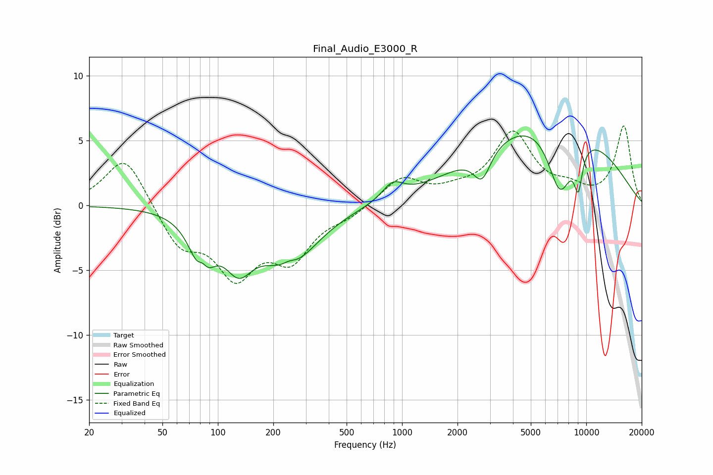

# Final_Audio_E3000_R
See [usage instructions](https://github.com/jaakkopasanen/AutoEq#usage) for more options and info.

### Parametric EQs
Apply preamp of -5.4 dB when using parametric equalizer.

|   # | Type    |   Fc (Hz) |    Q |   Gain (dB) |
|-----|---------|-----------|------|-------------|
|   1 | Peaking |        82 | 2.56 |        -4.8 |
|   2 | Peaking |        82 | 4.85 |         1.9 |
|   3 | Peaking |       129 | 1.83 |        -3.3 |
|   4 | Peaking |       242 | 0.93 |        -4.3 |
|   5 | Peaking |       243 | 3.66 |         0.5 |
|   6 | Peaking |       889 | 2.49 |         1.3 |
|   7 | Peaking |      2717 | 3    |        -2.3 |
|   8 | Peaking |      6337 | 0.35 |         7.1 |
|   9 | Peaking |      7204 | 1.97 |        -5.4 |
|  10 | Peaking |      9058 | 5.64 |        -3   |

### Fixed Band EQs
When using fixed band (also called graphic) equalizer, apply preamp of **-6.2 dB** (if available) and set gains manually with these parameters.

|   # | Type    |   Fc (Hz) |    Q |   Gain (dB) |
|-----|---------|-----------|------|-------------|
|   1 | Peaking |        31 | 1.41 |         4   |
|   2 | Peaking |        62 | 1.41 |        -3   |
|   3 | Peaking |       125 | 1.41 |        -4.9 |
|   4 | Peaking |       250 | 1.41 |        -3.7 |
|   5 | Peaking |       500 | 1.41 |        -0.7 |
|   6 | Peaking |      1000 | 1.41 |         2.1 |
|   7 | Peaking |      2000 | 1.41 |         0.7 |
|   8 | Peaking |      4000 | 1.41 |         5.3 |
|   9 | Peaking |      8000 | 1.41 |         1   |
|  10 | Peaking |     16000 | 1.41 |         6   |

### Graphs

