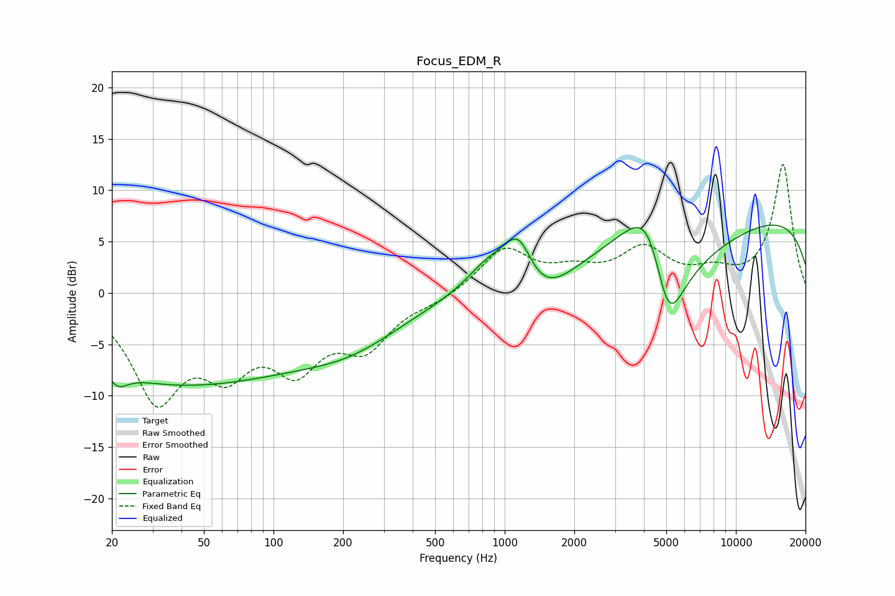

# Focus_EDM_R
See [usage instructions](https://github.com/jaakkopasanen/AutoEq#usage) for more options and info.

### Parametric EQs
Apply preamp of -6.7 dB when using parametric equalizer.

|   # | Type    |   Fc (Hz) |    Q |   Gain (dB) |
|-----|---------|-----------|------|-------------|
|   1 | Peaking |        20 | 1.85 |         6.7 |
|   2 | Peaking |        21 | 2.38 |        -6.5 |
|   3 | Peaking |        30 | 0.18 |        -9.1 |
|   4 | Peaking |       223 | 0.62 |        -2.8 |
|   5 | Peaking |       865 | 1.38 |         2.9 |
|   6 | Peaking |      1148 | 2.3  |         4.6 |
|   7 | Peaking |      1438 | 1.18 |        -3.2 |
|   8 | Peaking |      4272 | 1    |        14.3 |
|   9 | Peaking |      5063 | 1.03 |       -20   |
|  10 | Peaking |      9864 | 0.18 |         8.3 |

### Fixed Band EQs
When using fixed band (also called graphic) equalizer, apply preamp of **-12.6 dB** (if available) and set gains manually with these parameters.

|   # | Type    |   Fc (Hz) |    Q |   Gain (dB) |
|-----|---------|-----------|------|-------------|
|   1 | Peaking |        31 | 1.41 |        -9.7 |
|   2 | Peaking |        62 | 1.41 |        -5.9 |
|   3 | Peaking |       125 | 1.41 |        -6.1 |
|   4 | Peaking |       250 | 1.41 |        -4.6 |
|   5 | Peaking |       500 | 1.41 |        -0.7 |
|   6 | Peaking |      1000 | 1.41 |         4.3 |
|   7 | Peaking |      2000 | 1.41 |         1.6 |
|   8 | Peaking |      4000 | 1.41 |         3.9 |
|   9 | Peaking |      8000 | 1.41 |         1.6 |
|  10 | Peaking |     16000 | 1.41 |        12.5 |

### Graphs

