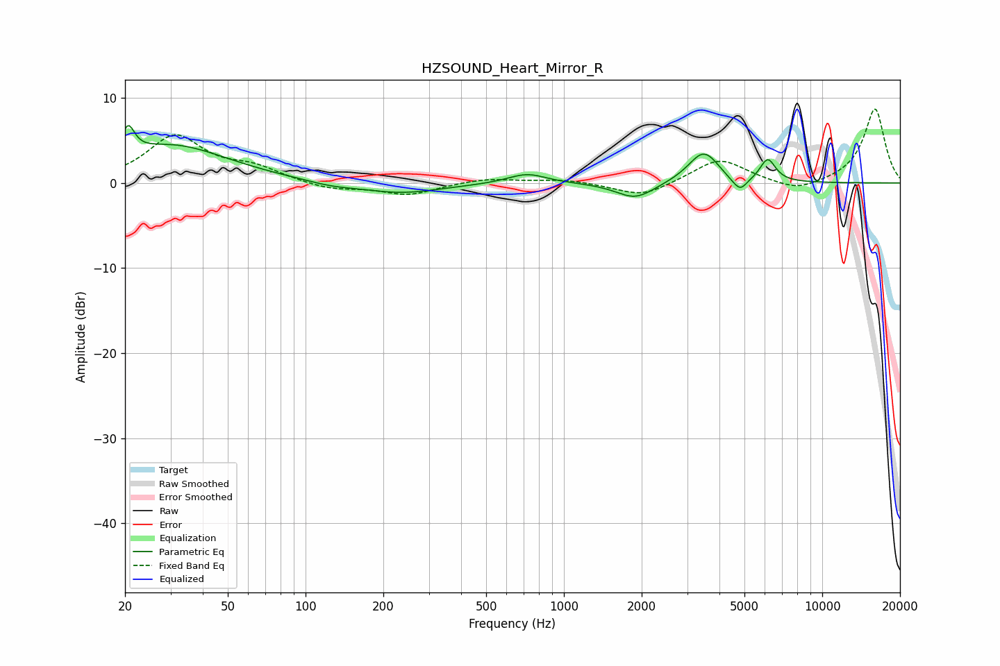

# HZSOUND_Heart_Mirror_R
See [usage instructions](https://github.com/jaakkopasanen/AutoEq#usage) for more options and info.

### Parametric EQs
Apply preamp of -6.8 dB when using parametric equalizer.

|   # | Type    |   Fc (Hz) |    Q |   Gain (dB) |
|-----|---------|-----------|------|-------------|
|   1 | Peaking |        21 | 5.79 |         3.3 |
|   2 | Peaking |        30 | 0.65 |         4.4 |
|   3 | Peaking |       126 | 1.52 |        -0.4 |
|   4 | Peaking |       234 | 0.9  |        -1.2 |
|   5 | Peaking |       720 | 1.88 |         1.2 |
|   6 | Peaking |      1890 | 1.89 |        -1.9 |
|   7 | Peaking |      3482 | 2.34 |         3.8 |
|   8 | Peaking |      4657 | 3    |        -0.9 |
|   9 | Peaking |      4827 | 5.99 |        -1   |
|  10 | Peaking |      6154 | 4.54 |         2.7 |

### Fixed Band EQs
When using fixed band (also called graphic) equalizer, apply preamp of **-8.8 dB** (if available) and set gains manually with these parameters.

|   # | Type    |   Fc (Hz) |    Q |   Gain (dB) |
|-----|---------|-----------|------|-------------|
|   1 | Peaking |        31 | 1.41 |         5.4 |
|   2 | Peaking |        62 | 1.41 |         1.5 |
|   3 | Peaking |       125 | 1.41 |        -0.8 |
|   4 | Peaking |       250 | 1.41 |        -1.4 |
|   5 | Peaking |       500 | 1.41 |         0.6 |
|   6 | Peaking |      1000 | 1.41 |         0.4 |
|   7 | Peaking |      2000 | 1.41 |        -1.7 |
|   8 | Peaking |      4000 | 1.41 |         2.9 |
|   9 | Peaking |      8000 | 1.41 |        -1.2 |
|  10 | Peaking |     16000 | 1.41 |         8.8 |

### Graphs

