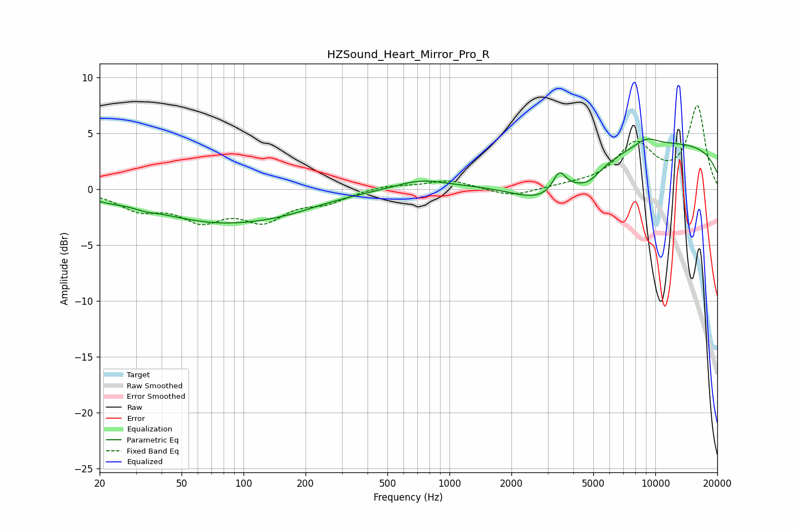

# HZSound_Heart_Mirror_Pro_R
See [usage instructions](https://github.com/jaakkopasanen/AutoEq#usage) for more options and info.

### Parametric EQs
Apply preamp of -4.6 dB when using parametric equalizer.

|   # | Type    |   Fc (Hz) |    Q |   Gain (dB) |
|-----|---------|-----------|------|-------------|
|   1 | Peaking |        22 | 1.89 |        -0.3 |
|   2 | Peaking |        33 | 2.83 |        -0.2 |
|   3 | Peaking |        79 | 0.42 |        -2.9 |
|   4 | Peaking |       169 | 0.96 |        -0.3 |
|   5 | Peaking |       722 | 1.15 |         0.8 |
|   6 | Peaking |      2936 | 0.78 |        -3.4 |
|   7 | Peaking |      3416 | 4.49 |         1.8 |
|   8 | Peaking |      4745 | 2.12 |        -1.2 |
|   9 | Peaking |      9048 | 2.24 |         0.8 |
|  10 | Peaking |     10000 | 0.18 |         4.2 |

### Fixed Band EQs
When using fixed band (also called graphic) equalizer, apply preamp of **-7.5 dB** (if available) and set gains manually with these parameters.

|   # | Type    |   Fc (Hz) |    Q |   Gain (dB) |
|-----|---------|-----------|------|-------------|
|   1 | Peaking |        31 | 1.41 |        -1.6 |
|   2 | Peaking |        62 | 1.41 |        -2.4 |
|   3 | Peaking |       125 | 1.41 |        -2.5 |
|   4 | Peaking |       250 | 1.41 |        -1   |
|   5 | Peaking |       500 | 1.41 |         0.4 |
|   6 | Peaking |      1000 | 1.41 |         0.8 |
|   7 | Peaking |      2000 | 1.41 |        -0.7 |
|   8 | Peaking |      4000 | 1.41 |         0.2 |
|   9 | Peaking |      8000 | 1.41 |         3.9 |
|  10 | Peaking |     16000 | 1.41 |         7.3 |

### Graphs

