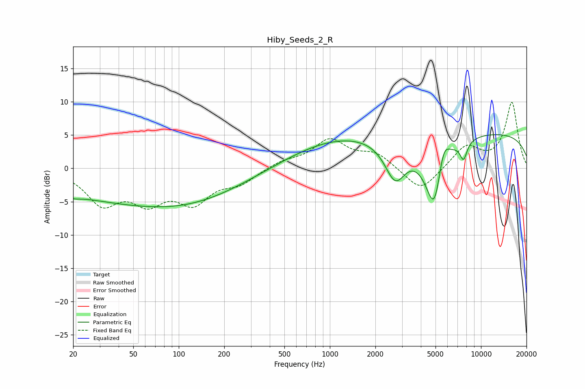

# Hiby_Seeds_2_R
See [usage instructions](https://github.com/jaakkopasanen/AutoEq#usage) for more options and info.

### Parametric EQs
Apply preamp of -5.2 dB when using parametric equalizer.

|   # | Type    |   Fc (Hz) |    Q |   Gain (dB) |
|-----|---------|-----------|------|-------------|
|   1 | Peaking |        20 | 3.4  |        -0.5 |
|   2 | Peaking |        48 | 0.23 |        -4.6 |
|   3 | Peaking |       136 | 0.38 |        -1.8 |
|   4 | Peaking |       969 | 0.48 |         1.4 |
|   5 | Peaking |      1224 | 0.39 |         2.4 |
|   6 | Peaking |      2707 | 1.99 |        -6   |
|   7 | Peaking |      4937 | 2.15 |       -11.9 |
|   8 | Peaking |      5613 | 3.28 |         5.1 |
|   9 | Peaking |      7667 | 5.72 |        -2.6 |
|  10 | Peaking |     10000 | 0.18 |         5.4 |

### Fixed Band EQs
When using fixed band (also called graphic) equalizer, apply preamp of **-10.0 dB** (if available) and set gains manually with these parameters.

|   # | Type    |   Fc (Hz) |    Q |   Gain (dB) |
|-----|---------|-----------|------|-------------|
|   1 | Peaking |        31 | 1.41 |        -5   |
|   2 | Peaking |        62 | 1.41 |        -4.3 |
|   3 | Peaking |       125 | 1.41 |        -4.6 |
|   4 | Peaking |       250 | 1.41 |        -2   |
|   5 | Peaking |       500 | 1.41 |         1   |
|   6 | Peaking |      1000 | 1.41 |         4.1 |
|   7 | Peaking |      2000 | 1.41 |         2.1 |
|   8 | Peaking |      4000 | 1.41 |        -3.7 |
|   9 | Peaking |      8000 | 1.41 |         3.3 |
|  10 | Peaking |     16000 | 1.41 |         9.8 |

### Graphs

