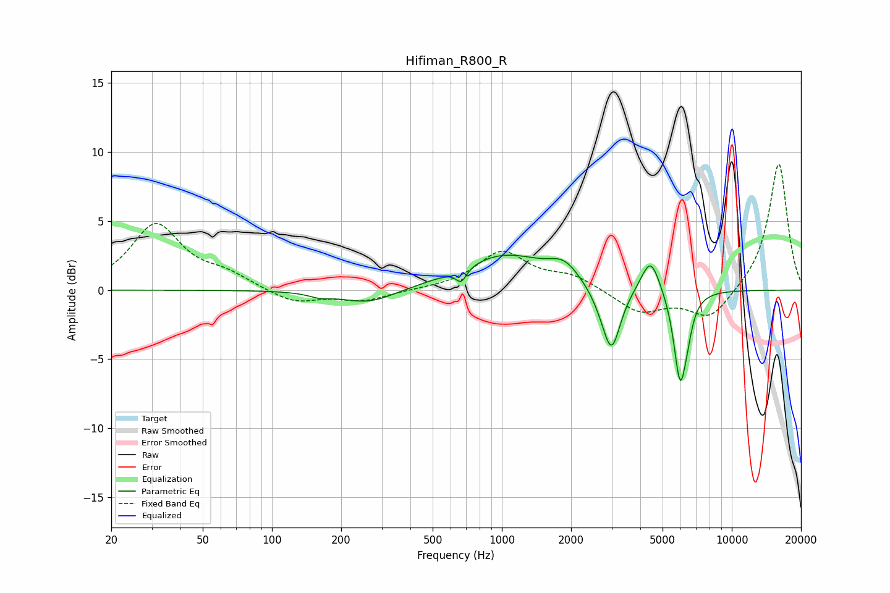

# Hifiman_R800_R
See [usage instructions](https://github.com/jaakkopasanen/AutoEq#usage) for more options and info.

### Parametric EQs
Apply preamp of -2.6 dB when using parametric equalizer.

|   # | Type    |   Fc (Hz) |    Q |   Gain (dB) |
|-----|---------|-----------|------|-------------|
|   1 | Peaking |       162 | 2.94 |        -0.3 |
|   2 | Peaking |       263 | 1.19 |        -1   |
|   3 | Peaking |       666 | 6    |        -1   |
|   4 | Peaking |      1023 | 0.75 |         2.5 |
|   5 | Peaking |      1866 | 2.18 |         1.2 |
|   6 | Peaking |      2754 | 2.64 |        -0.8 |
|   7 | Peaking |      3003 | 3.66 |        -4.2 |
|   8 | Peaking |      4433 | 3.46 |         2.6 |
|   9 | Peaking |      5963 | 4.94 |        -6.4 |
|  10 | Peaking |      6417 | 6    |        -1   |

### Fixed Band EQs
When using fixed band (also called graphic) equalizer, apply preamp of **-9.2 dB** (if available) and set gains manually with these parameters.

|   # | Type    |   Fc (Hz) |    Q |   Gain (dB) |
|-----|---------|-----------|------|-------------|
|   1 | Peaking |        31 | 1.41 |         4.7 |
|   2 | Peaking |        62 | 1.41 |         0.9 |
|   3 | Peaking |       125 | 1.41 |        -1   |
|   4 | Peaking |       250 | 1.41 |        -0.8 |
|   5 | Peaking |       500 | 1.41 |         0   |
|   6 | Peaking |      1000 | 1.41 |         2.7 |
|   7 | Peaking |      2000 | 1.41 |         1   |
|   8 | Peaking |      4000 | 1.41 |        -1.6 |
|   9 | Peaking |      8000 | 1.41 |        -2.1 |
|  10 | Peaking |     16000 | 1.41 |         9.3 |

### Graphs

