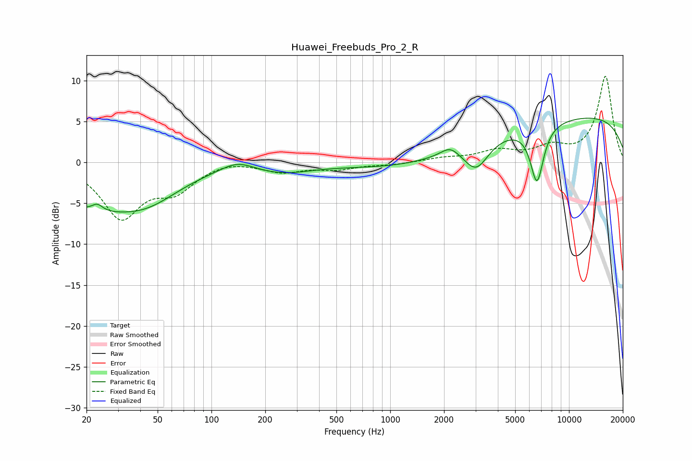

# Huawei_Freebuds_Pro_2_R
See [usage instructions](https://github.com/jaakkopasanen/AutoEq#usage) for more options and info.

### Parametric EQs
Apply preamp of -5.5 dB when using parametric equalizer.

|   # | Type    |   Fc (Hz) |    Q |   Gain (dB) |
|-----|---------|-----------|------|-------------|
|   1 | Peaking |        20 | 0.66 |        -4.3 |
|   2 | Peaking |        23 | 4.58 |         1   |
|   3 | Peaking |        43 | 0.73 |        -3.7 |
|   4 | Peaking |       139 | 1.54 |         1.2 |
|   5 | Peaking |       250 | 0.87 |        -1.1 |
|   6 | Peaking |      2162 | 2.83 |         1.1 |
|   7 | Peaking |      3029 | 2.03 |        -3.5 |
|   8 | Peaking |      4825 | 0.18 |        -3.9 |
|   9 | Peaking |      6622 | 3.62 |        -7.1 |
|  10 | Peaking |      8632 | 0.2  |         9   |

### Fixed Band EQs
When using fixed band (also called graphic) equalizer, apply preamp of **-10.6 dB** (if available) and set gains manually with these parameters.

|   # | Type    |   Fc (Hz) |    Q |   Gain (dB) |
|-----|---------|-----------|------|-------------|
|   1 | Peaking |        31 | 1.41 |        -6.5 |
|   2 | Peaking |        62 | 1.41 |        -3   |
|   3 | Peaking |       125 | 1.41 |         0.4 |
|   4 | Peaking |       250 | 1.41 |        -1.1 |
|   5 | Peaking |       500 | 1.41 |        -0.8 |
|   6 | Peaking |      1000 | 1.41 |        -0.3 |
|   7 | Peaking |      2000 | 1.41 |         0.5 |
|   8 | Peaking |      4000 | 1.41 |         1.3 |
|   9 | Peaking |      8000 | 1.41 |         1.6 |
|  10 | Peaking |     16000 | 1.41 |        10.5 |

### Graphs

