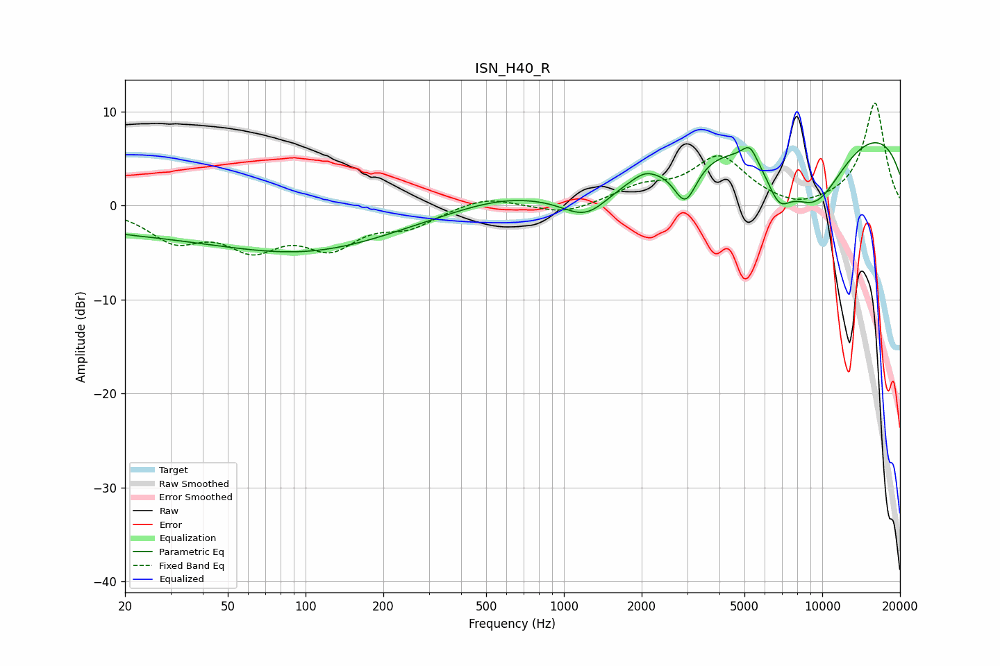

# ISN_H40_R
See [usage instructions](https://github.com/jaakkopasanen/AutoEq#usage) for more options and info.

### Parametric EQs
Apply preamp of -6.8 dB when using parametric equalizer.

|   # | Type    |   Fc (Hz) |    Q |   Gain (dB) |
|-----|---------|-----------|------|-------------|
|   1 | Peaking |        20 | 0.32 |        -2.3 |
|   2 | Peaking |       107 | 0.42 |        -4.3 |
|   3 | Peaking |       564 | 0.78 |         1   |
|   4 | Peaking |      1223 | 1.47 |        -3.2 |
|   5 | Peaking |      2045 | 3.41 |         0.6 |
|   6 | Peaking |      2952 | 3.05 |        -4.6 |
|   7 | Peaking |      5241 | 4.66 |         1.8 |
|   8 | Peaking |      6794 | 2.81 |        -3.4 |
|   9 | Peaking |      9292 | 0.9  |        -8.9 |
|  10 | Peaking |      9913 | 0.18 |         9.9 |

### Fixed Band EQs
When using fixed band (also called graphic) equalizer, apply preamp of **-11.0 dB** (if available) and set gains manually with these parameters.

|   # | Type    |   Fc (Hz) |    Q |   Gain (dB) |
|-----|---------|-----------|------|-------------|
|   1 | Peaking |        31 | 1.41 |        -3.3 |
|   2 | Peaking |        62 | 1.41 |        -3.9 |
|   3 | Peaking |       125 | 1.41 |        -3.9 |
|   4 | Peaking |       250 | 1.41 |        -1.9 |
|   5 | Peaking |       500 | 1.41 |         1.1 |
|   6 | Peaking |      1000 | 1.41 |        -1   |
|   7 | Peaking |      2000 | 1.41 |         1.7 |
|   8 | Peaking |      4000 | 1.41 |         5   |
|   9 | Peaking |      8000 | 1.41 |        -0.8 |
|  10 | Peaking |     16000 | 1.41 |        11   |

### Graphs

