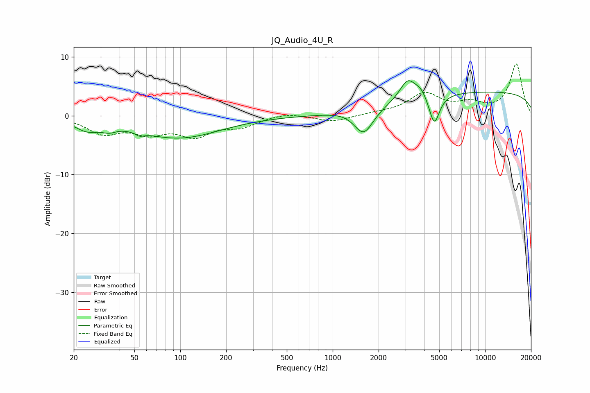

# JQ_Audio_4U_R
See [usage instructions](https://github.com/jaakkopasanen/AutoEq#usage) for more options and info.

### Parametric EQs
Apply preamp of -6.0 dB when using parametric equalizer.

|   # | Type    |   Fc (Hz) |    Q |   Gain (dB) |
|-----|---------|-----------|------|-------------|
|   1 | Peaking |        24 | 1.71 |        -1.8 |
|   2 | Peaking |        34 | 3.23 |        -0.8 |
|   3 | Peaking |        54 | 5.3  |        -0.6 |
|   4 | Peaking |        97 | 0.52 |        -3.7 |
|   5 | Peaking |      1276 | 1.46 |         0.4 |
|   6 | Peaking |      1594 | 2.17 |        -4.6 |
|   7 | Peaking |      3109 | 2.65 |         3.5 |
|   8 | Peaking |      3803 | 3.69 |         1.2 |
|   9 | Peaking |      4642 | 4.09 |        -5.2 |
|  10 | Peaking |     10000 | 0.18 |         4   |

### Fixed Band EQs
When using fixed band (also called graphic) equalizer, apply preamp of **-8.9 dB** (if available) and set gains manually with these parameters.

|   # | Type    |   Fc (Hz) |    Q |   Gain (dB) |
|-----|---------|-----------|------|-------------|
|   1 | Peaking |        31 | 1.41 |        -2.8 |
|   2 | Peaking |        62 | 1.41 |        -2.5 |
|   3 | Peaking |       125 | 1.41 |        -3.1 |
|   4 | Peaking |       250 | 1.41 |        -1.6 |
|   5 | Peaking |       500 | 1.41 |         0.6 |
|   6 | Peaking |      1000 | 1.41 |        -1   |
|   7 | Peaking |      2000 | 1.41 |         0.3 |
|   8 | Peaking |      4000 | 1.41 |         3.6 |
|   9 | Peaking |      8000 | 1.41 |         1.7 |
|  10 | Peaking |     16000 | 1.41 |         8.7 |

### Graphs

