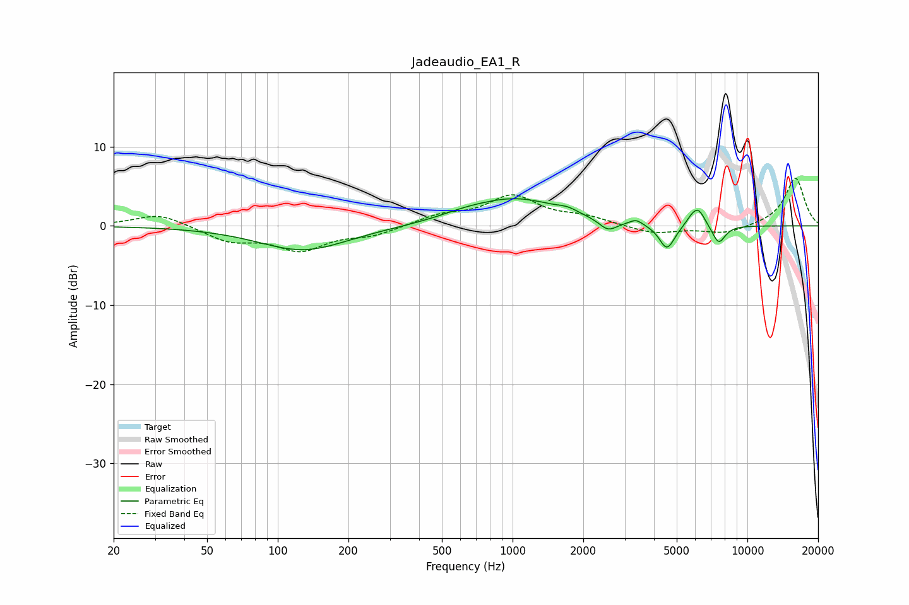

# Jadeaudio_EA1_R
See [usage instructions](https://github.com/jaakkopasanen/AutoEq#usage) for more options and info.

### Parametric EQs
Apply preamp of -3.5 dB when using parametric equalizer.

|   # | Type    |   Fc (Hz) |    Q |   Gain (dB) |
|-----|---------|-----------|------|-------------|
|   1 | Peaking |       128 | 0.75 |        -3.1 |
|   2 | Peaking |       620 | 1.32 |         0.5 |
|   3 | Peaking |      1035 | 0.74 |         3.3 |
|   4 | Peaking |      1713 | 3.39 |         0.5 |
|   5 | Peaking |      2550 | 3.67 |        -1.4 |
|   6 | Peaking |      3358 | 5.3  |         0.7 |
|   7 | Peaking |      4546 | 4.23 |        -3.2 |
|   8 | Peaking |      5737 | 6    |         0.5 |
|   9 | Peaking |      6161 | 4.49 |         2.3 |
|  10 | Peaking |      7547 | 4.72 |        -2.4 |

### Fixed Band EQs
When using fixed band (also called graphic) equalizer, apply preamp of **-6.1 dB** (if available) and set gains manually with these parameters.

|   # | Type    |   Fc (Hz) |    Q |   Gain (dB) |
|-----|---------|-----------|------|-------------|
|   1 | Peaking |        31 | 1.41 |         1.6 |
|   2 | Peaking |        62 | 1.41 |        -1.8 |
|   3 | Peaking |       125 | 1.41 |        -2.9 |
|   4 | Peaking |       250 | 1.41 |        -1.1 |
|   5 | Peaking |       500 | 1.41 |         1.2 |
|   6 | Peaking |      1000 | 1.41 |         3.6 |
|   7 | Peaking |      2000 | 1.41 |         1   |
|   8 | Peaking |      4000 | 1.41 |        -1   |
|   9 | Peaking |      8000 | 1.41 |        -1   |
|  10 | Peaking |     16000 | 1.41 |         6.1 |

### Graphs

