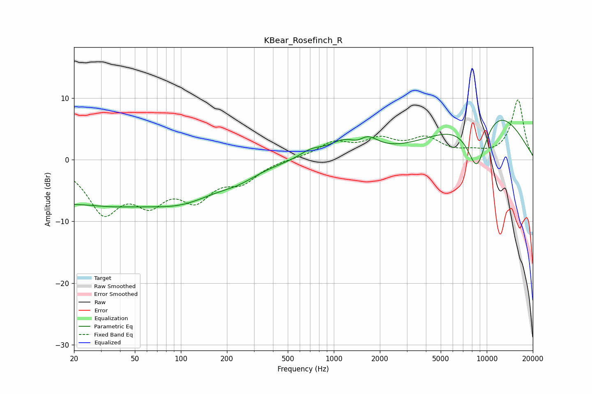

# KBear_Rosefinch_R
See [usage instructions](https://github.com/jaakkopasanen/AutoEq#usage) for more options and info.

### Parametric EQs
Apply preamp of -6.5 dB when using parametric equalizer.

|   # | Type    |   Fc (Hz) |    Q |   Gain (dB) |
|-----|---------|-----------|------|-------------|
|   1 | Peaking |        21 | 0.32 |        -7.6 |
|   2 | Peaking |        23 | 0.98 |         0.9 |
|   3 | Peaking |       106 | 0.57 |        -4.7 |
|   4 | Peaking |       239 | 1.15 |        -1.3 |
|   5 | Peaking |       710 | 1.84 |         1.3 |
|   6 | Peaking |      1166 | 1.39 |         2.3 |
|   7 | Peaking |      1441 | 2.94 |        -0.9 |
|   8 | Peaking |      1646 | 2    |         2.2 |
|   9 | Peaking |      8614 | 1.77 |        -9.9 |
|  10 | Peaking |      9894 | 0.45 |         9.6 |

### Fixed Band EQs
When using fixed band (also called graphic) equalizer, apply preamp of **-9.8 dB** (if available) and set gains manually with these parameters.

|   # | Type    |   Fc (Hz) |    Q |   Gain (dB) |
|-----|---------|-----------|------|-------------|
|   1 | Peaking |        31 | 1.41 |        -7.9 |
|   2 | Peaking |        62 | 1.41 |        -5.6 |
|   3 | Peaking |       125 | 1.41 |        -5.4 |
|   4 | Peaking |       250 | 1.41 |        -3   |
|   5 | Peaking |       500 | 1.41 |         0.1 |
|   6 | Peaking |      1000 | 1.41 |         2.5 |
|   7 | Peaking |      2000 | 1.41 |         2.8 |
|   8 | Peaking |      4000 | 1.41 |         3.1 |
|   9 | Peaking |      8000 | 1.41 |         0.8 |
|  10 | Peaking |     16000 | 1.41 |         9.7 |

### Graphs

